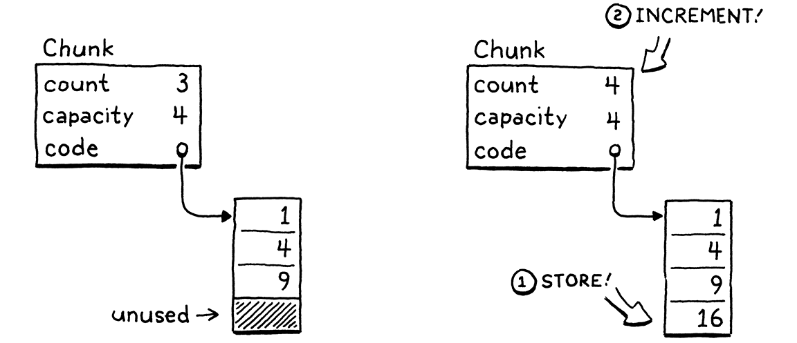

= 制作解释器
:icons: font
:source-highlighter: pygments
:toc: left
:toclevels: 4
:sectnums:
:doctype: book
:stem: latexmath

[preface]
= 前言

这本书包含了实现一门脚本语言所需要的所有知识。这门脚本语言包含诸多特性，且运行速度很快。我们将会学到像语法分析和语义这样的高层概念，也会学到像字节码和垃圾收集这样的底层概念。我们将会经历一场头脑风暴，还会写很多很多的代码。这是一场知识风暴！

从main()函数开始，我们将会构建一种编程语言。这个编程语言有着丰富的语法：动态类型，垃圾收集，词法作用域，函数作为一等公民，闭包，类和继承。所有这些都包含在了我们所写的几千行代码中。由于每一行代码都要我们亲自动手去写，所以我们会对这门编程语言的实现细节有一个透彻的理解。

= 第一部分：欢迎

这可能将会是一个伟大旅程的开始。编程语言这个领域有着巨大的探索和玩耍的空间。你可以在这个大房子里尽情的创造，可以把你做的东西分享给别人，也可以仅仅是娱乐自己。很多伟大的计算机科学家和软件工程师将他们一生的精力都投入到了这个领域，而这个领域却还远远没有到头。如果这本书是你踏入这个领域所接触的第一本书，欢迎你！

这本书将带着你在编程语言的世界里旅行一番。但在我们穿好登山靴出去旅行之前，我们需要先熟悉一下我们要旅行的地点的整个地图。这一部分的章节将会带我们学习一些编程语言中用到的基本概念，以及这些概念的组织方式。

我们也会对Lox这门语言非常熟悉。因为我们将要在书中剩下的部分实现这门语言（要实现两遍！）。

== 介绍

> 童话故事超越了真实：不是因为童话故事告诉我们恶龙是存在的，而是因为童话故事告诉了我们恶龙是可以被击败的。-G.K.切斯特顿

能够和大家一起踏上旅程，我非常激动。这是一本有关为编程语言实现解释器的书。同时也是一本有关如何设计一门有价值的编程语言的书。我非常希望在我投入到编程语言这个领域的初期就能碰到这样一本书。而这本书在我的大脑中中已经写了将近十年了。

在本书中，我们将会一步一步的为一门具有诸多特性的编程语言实现两个完整的解释器。这里我会假设本书的读者是初次涉猎编程语言这个领域。所以，构建一个完整的，可用的，运行速度快的编程语言所需要的每一个概念和每一行代码，本书都会详细讲解。

为了覆盖两个完整的解释器的实现，同时不会把读者劝退，书里面的内容相对于其他同类型的书籍，理论方面会偏弱一些。由于我们要构建解释器的每一个模块，所以我在构建每一个模块的时候，都会相对应的介绍模块背后的历史以及所涉及的概念。我会尽量让读者朋友熟悉所涉及的每一个术语，这样当你身处于一堆编程语言专家参加的鸡尾酒会时，能够很好的融入进去。

我们主要的精力会花在将语言实现出来，跑起来。这并不是说理论是不重要的。对于编程语言理论这个领域，能够对编程语言的语法和语义进行严谨的且形式化的推理是非常重要的技能。但就我个人而言，通过实现一门语言来学习是一种最好的方式（learn by doing）。对我来说，读一本充满了抽象概念的书，很难真正的吸收它们（内涵龙书？哈哈）。但如果我能写一些代码，跑起来，调试一下，我就能真正学会这些知识。

下面是我对读者朋友的一点期望。读完这本书以后，希望你们对真正的编程语言是如何工作的有强烈的直觉力。希望你们后面再读其他更加理论的书籍时，很多概念已经深深的扎根在你们的大脑中了，深深的印在了你们的脑海里。

> 静态类型系统（Haskell，OCaml之类的语言）尤其需要严格的形式化推理。摆弄（hacking，我翻译成了摆弄）一个类型系统就好像是在做数学中的定理证明题。

> 类型系统和定理证明的相似性并不是巧合。在上个世纪的前半页，Haskell Curry和William Alvin Howard这两个人展示了类型系统和定理证明是一枚硬币的两面。Curry-Howard同构。

=== 为什么要学习这些东西？

每一本介绍编译器的书都会有这一部分。我不太明白这些书为什么总是怀疑自己存在的必要性。比如鸟类学的书就不需要写“为什么要学习鸟类学”这种内容。它们通常假设读者是喜欢鸟儿的，然后就开始讲解了。

但是有关编程语言的书（编译器、编程语言理论）有一些不同。作为程序员，创建一门成功的、通用性的编程语言这个需求是非常罕见的。那些用的最多的编程语言（C、Java、Python等）既可以用在敞篷露营车，也可以用在大众公共汽车。这样的编程语言的设计者是最最顶尖的程序员。如果说想要进入这些人的行列是学习编程语言相关知识的唯一理由的话，那的确是没必要学的。幸好不是这样的，也就是是说每一个程序员都需要学习编程语言方面的知识。

==== 小型编程语言到处都是

相对于每一门成功的通用型编程语言，都有数以千计的成功的“小语言”。我们以前叫它们“小语言”，随着术语的“通货膨胀”，我们越来越倾向于叫它们“领域特定语言”（DSL，Domain-Specific Languages）。这些小小的语言都是为了特定的任务准备的。比如应用程序的脚本语言，模板引擎（Jinja2之类的），标记语言（Markdown，Asciidoc之类的），以及配置文件等等。

image:little-languages.png[]

几乎每一个大型软件项目都需要很多种这样的小语言。正常情况来讲，我们最好去使用已有的编程语言，而不是自己造一个。自己造轮子要考虑的东西太多了：文档，调试器，对编辑器的支持，语法高亮，还有很多其他的坑。所以自己造轮子还是很费劲的。

但在一些非正常的情况下，你会发现你可能需要自己写一个解析器（parser）或者其他的工具。因为你想用的工具并不存在，只能自己写。即使你正在使用一些已有的工具，你可能也无法避免去调试这些工具，给这些工具修复错误（已有的工具所存在的bug很多！）。

==== 构建编程语言是一种伟大的练习方式

长跑运动员有时候会在他们的脚踝上负重，或者去高海拔而空气稀薄的地方进行训练。当他们卸下脚踝上的负重，并且来到海拔低的地方长跑时，轻松的脚踝和丰富的含氧量会让他们跑的更快，跑的更远。

实现一门编程语言是对编程水平的一种很真实的测验（比做算法题好，哈哈）。因为需要写的代码非常复杂，性能也至关重要。你必须熟练掌握递归，动态数组，树，图和哈希表。你可能每天都在用哈希表，但你真的彻底理解哈希表吗？好办，在亲手制作了我们自己的编程语言之后，我保证你会彻底理解哈希表。

我会向你展示实现一个解释器并不像你想象的那样是一件非常恐怖的事情。尽管如此，这件事依然是一个很大的挑战。克服了这个大的挑战，你将会成为一个更加强大的程序员，也能在你每天的工作中，更加聪明的去使用那些数据结构和算法。

==== 最后一个原因

最后一个原因对于我个人而言有点难以承认，因为这个原因隐藏在我的心底。当我还是个孩子的时候，我开始学习编程，编程语言有一些我觉得很神奇的东西。当我一个字母一个字母的敲出了一些BASIC程序时，我搞不明白BASIC本身是怎么实现出来的。

再后来，当我的大学朋友们谈起他们的编译器课程时，脸上浮现出的那种敬畏和恐惧，足以使我相信编程语言黑客是一种人类中的特殊物种——他们是一群魔术师，拥有操控某种密法的特权。

那是一幅诱人的图画，但它也有黑暗的一面。我并没有自己是魔术师的感觉，所以我觉得我天生缺少一种特质，而只有拥有这种特质，才能进入魔术师的行列。尽管从我在学校的笔记本上写编程语言的关键字的时候开始，我就被编程语言深深的吸引。但过了很多年，我才能鼓起勇气去真正的尝试去学习它们。那种“魔术般”的特质，那种排他性，将我排除在外。

> 而编程语言领域的从业者们，也毫不犹豫的构建了这样一幅图画。两本有关编程语言的著名课本(SICP和龙书)将恶龙和魔术师作为了它们的封面。

而当我开始拼凑自己的小小的解释器时，我很快就发现，根本没有任何魔法。都是代码而已，而那些摆弄编程语言的人也都是人。

这里面是有一些你在编程语言这个领域之外没有碰到过的技术，也有一些部分有点难。但并不会比你碰到的其他困难更难解决。如果你被编程语言方面的东西所震慑，觉得这些东西很困难，我的这本书可以帮助你克服这种恐惧。希望你读完本书以后，能够比以前更加勇敢。

而且，谁知道呢？或许你就是下一门伟大的编程语言的创造者。毕竟需要有人做这样的事情。

=== 这本书是如何组织的

这本书由三部分组成。你现在正在阅读的是第一部分。第一部分的章节，会为你做一个全书导览，然后教会大家一些编程语言从业者所常用的行话（术语），最后给大家介绍Lox这门语言，也就是我们即将实现的编程语言。

剩下的两部分，每一部分都会实现一个完整的Lox解释器。这两部分的章节安排的思路都是一样的。每一章负责讲解一个单独的语言特性，会教大家语言特性背后的概念，然后把这个语言特性实现出来。

通过大量的尝试和试错，我终于可以做到把这两个解释器的实现切分成合适长度的章节，并且做到了每一章的学习只依赖于前面的章节，而不需要后面章节的知识。从第一章开始，你就能跑起你所编写的程序。随着一章接一章的学习，你写的代码将会迅速成长为一门具有很多功能的完整的编程语言。

除了丰富，闪耀的英文文章外，各章还有其他一些令人愉快的内容：

==== 代码

我们要做的事情是制作解释器，所以本书会包含真正的代码。书里面包含了每一行需要写的代码。我会告诉你每一个代码片段应该插入到你已经编写的代码中的具体位置。

很多其他有关编程语言和编程语言实现的书都会使用Lex和Yacc，即所谓的编译器的编译器（compiler-compilers），这样的工具。我们可以只写一些高层次的描述（比如词法和语法描述文件），这些工具就可以帮助我们产生一些源文件（词法分析器和语法分析器）。这些工具既有优点也有缺点，优点和缺点这两边都有很充分的理由——甚至有点宗教信仰的味道。

> Yacc这个工具的输入是一个语法文件，输出是为编译器产生的源文件。所以Yacc有点像一个输出编译器的“编译器”，所以我们叫这类工具“编译器的编译器（compiler-compilers）”。

> Yacc并非此类工具的首创，所以它的名字叫做“Yacc”——Yet Another Compiler-Compiler。后来又出现了一个相似的工具叫做Bison。

在本书中我们将不使用这类工具。我要保证任何魔术和困惑都没有藏身之处，所以我们会手写所有的功能。你会发现，其实手写所有功能并没有想象的那么难，而且这样做可以保证我们能够理解解释器实现中的每一行代码，彻底理解解释器的运行机制。

编写教学代码和“真实世界”的代码是有所不同的。所以书里面的代码风格并不是编写可维护的生产软件所采用的最佳实践。说的更明白一些，就是，我可能会删除private变量或者定义一个全局变量，这样做是为了代码更容易理解（设计模式用的越多，代码越难理解）。毕竟书本的大小比你平常用的IDE差远了，而且设计模式用的越多，代码量就越大，书也就越厚。

还有，书中的代码不会有很多注释。因为每一个代码片段都会有好几段文字去解释它。如果你要配合你的代码写一本书，那么建议你删去代码中的注释。否则的话，你可能会用很多很多 `//` （排版也不好看，国内很多书都是这样）。

虽然本书包含了解释器实现的每一行代码，并详细讲解了每行代码的作用，但我并没有写如何编译和运行我们所写的解释器。我假设你有能力攒一个makefile文件来运行代码，或者用IDE来运行代码（毕竟我们现在都在写解释器了，这些能力还是要有的）。类似于makefile或者使用IDE的那种手把手的教程很快就会过时（因为IDE不断的升级，用法会改变），而我希望我的书像人头马XO一样能够长久保存。

==== 代码片段

由于本书包含了实现解释器所要写的每一行代码，所以代码片段必须非常精确。还有，由于我想让我们写的程序即使在缺乏一些主要功能的情况下，依然能够跑起来，所以有时候我会编写一些临时代码保证程序能够运行，这些临时代码会在后面被其他代码片段替换。

下面是一个包含了所有要素的精确的代码片段的示例：

.lox/Scanner.java in scanToken() replace 1 line
[source,c,linenums,highlight=2..6]
----
      default:
        if (isDigit(c)) {
          number();
        } else {
          Lox.error(line, "Unexpected character.");
        }
        break;
----

上面代码片段的中间，是我们要添加的新代码。新代码的上面和下面的阴影部分中的代码是我们之前编写的已经存在的代码。代码片段的附近还有一段文本来告诉你这段代码在哪个文件里面，以及在文件中的哪个位置去添加这段代码。如果这段文本写了“替换 _ 某些行”，意思就是你需要删除阴影中的之前写过的代码，然后替换成新的代码片段。

==== 旁注

旁注包含了一些传记素描，历史背景的介绍，相关话题的链接以及探索其他相关领域的一些建议。旁注中的内容对于你理解书中的内容不是必须的，所以你不想看可以忽略掉它们。不过你要是真的忽略了它们，我可能会有点小伤心，哈哈。

> 旁注中的大部分都是一些冷笑话和我业余画的一些小画。

==== 挑战

每一章的结尾部分都会留一些练习。不过不像平常我们读的课本，练习是为了复习和巩固你已经学习过的内容。我所留的练习题，是为了帮助你学习更多在我的书里没有的内容。这些练习会逼迫你走出我写的书所划定的范围，探索你自己的知识。会让你去研究其他的编程语言，去研究如何实现这些语言的特性。目的就是为了让你跳出舒适区。

征服了这些挑战，你会对编程语言这个领域有更加广泛的了解，也可能会有一点坑需要踩。你也可以忽略掉这些练习，待在舒适区里，这些都无所谓。

> 一点提醒：这些挑战练习可能会要求你修改你写的代码。你最好复制一份到别的地方去修改。因为后面的章节都是假设你的代码是跟着章节正文内容走的，也就是没有做挑战练习的状态。

==== 语言设计笔记

大部分“编程语言”书籍都是编程语言的实现书籍。它们很少去讨论要实现的语言特性背后的设计思路，也就是为什么要设计这个语言特性。实现语言很有意思，因为语言是经过严格定义的。我们做程序员这一行的似乎都喜欢非黑即白的东西，所以可能会喜欢计算机这样由0和1组成的东西。

> 很多从事编程语言这一领域的程序员都是像上面我说的那样工作的。首先浏览一下语言规范，然后过一段时间，这个语言的实现就完成了，性能基准测试结果也出炉了。

从我个人的角度来看，这个世界只需要现在留下的这些FORTRAN 77的各种实现了，不再需要新的实现了（因为各种实现已经够多了）。如果有一天，你发现自己正在设计一门新的语言。一旦你开始玩这个游戏，那么人的因素就会凸显出来。什么是人的因素呢？比如这门新语言好学不好学，这门语言应该有很多创新（例如Rust），还是应该让人们看上去觉得这门语言似曾相识（例如Golang），语言的语法是否需要注重可读性（例如Python），以及这门语言的使用者主要是哪一个群体。

> 希望你设计的新语言不要把打孔卡的孔的大小写进语法。

以上所讲的这些东西都是你的语言能否成功的重要因素。我希望你设计的语言能够成功，所以在一些章节的末尾，我会写一段“语言设计笔记”，来讨论一下编程语言设计所考虑的一些人的因素。我并不是这方面的专家——我很怀疑谁真的是这方面的专家——所以就着一大撮盐吞下去吧。如果这些内容能够促进你的思考，我的目标也就达成了。

=== 我们要实现的第一个解释器

我们将会编写我们的第一个解释器，jlox，使用Java来实现。我们这个实现主要聚焦于概念的理解。所以我们将会编写最简单，最干净的代码来实现Lox这门语言的各种语义。这会使得我们很容易理解一些基本的技术，也能让我们对编程语言是如何工作的有一个准确的了解。

> 本书使用了Java和C语言，但是读者朋友们可以将代码用其他语言来实现。如果我用的语言正好你们不熟悉的话，可以看一下其他语言实现的版本。

Java这门语言非常适合用来实现解释器。首先，Java是一门高层语言，也就是说我们不需要关注很多底层的细节。但同时，Java这门语言写起来非常的清晰。Java可以隐藏底层复杂的各种细节。同时，由于Java是静态类型语言，所以我们能够清楚的看到我们使用的数据结构是什么，是数组，还是哈希表，还是链表等等（这点脚本语言做不到）。

我选择Java的另一个原因是Java是一门面向对象语言。这种编程范式兴趣于上世纪90年代，到现在已经成为了统治级的编程范式（每一个程序员都很了解）。所以阅读本书的读者朋友对代码组织成类和方法这种编程范式，应该已经很熟悉了。所以在编程范式上，我们就待在舒适区吧。

虽然很多学院派的编程语言研究人员有点看不上面向对象语言（他们更喜欢Haskell，Agda这种语言），但事实上，即使在编程语言这个领域，面向对象语言都有着非常广泛的使用。GCC和LLVM是用C++写的，大部分的JavaScript虚拟机也是用C++写的（例如V8）。面向对象语言是无处不在的，而通常某一门语言的编译器和各种编译工具都是由自己本身这门语言编写的，比如X语言的编译器通常是由X语言编写的。

> 编译器的作用是读取由某一门语言编写的程序，然后将这些程序翻译成另一门语言并输出。所以我们可以使用任意一门编程语言来实现编译器，包括这个编译器本身要编译的语言，比如可以使用Java来编写Java的编译器，这个过程叫做自举。

> 举个例子，如果我们使用C语言编写了一个Go语言的编译器，那么首先，我们需要使用别的C语言编译器先编译我们写的代码（例如使用GCC来编译你写的C编译器代码），然后我们写的编译器代码被编译成了一个Go语言编译器，这时，我们就拥有了一个GCC编译出来的Go语言编译器。由于我们有了一个Go语言编译器，我们就可以使用Go语言来开发Go语言本身的编译器了，也可以不断的添加新特性了。而之前使用C语言写的编译器代码就可以抛弃掉了。这就叫做自举，就像一个人把自己提了起来。

最后一个原因，Java实在是太流行了。这意味着读者朋友们大概率已经会写Java代码了，所以在阅读本书之前，你不需要太多的前置知识（不需要为了阅读本书而重新学习一门编程语言）。如果你对Java不是很熟悉，也不要着急。因为我会使用一个Java语言的最小子集（不会使用Java的所有特性）。为了使代码更紧凑，我会使用Java 7引入的钻石操作符特性，但这个特性也就是我使用的最高级的Java特性了。如果你学过其他面向对象编程语言，例如C#或者C++，那么阅读本书也会非常容易。

当阅读完第二部分的内容，我们就实现了一个简单的代码可读性很强的解释器了。这个解释器可能运行的不快，但绝对是正确的。尽管如此，我们的实现依赖了Java虚拟机的很多运行时特性。而我们非常想知道Java本身是如何实现这些运行时特性的，所以就有了第二个要实现的解释器。

=== 我们要实现的第二个解释器

所以这部分，我们要彻底重新实现一遍解释器，这次我们不用Java，用C语言。如果想要了解解释器真正的运行原理，C语言是实现的最佳语言，没有之一。因为使用C语言实现解释器，我们会一路探底到达内存中的字节这么底层，也会看到代码是如何在CPU上面执行的。

我们使用C语言的一个重要原因就是：我可以向你展示C语言所真正擅长做的事情是什么。但这意味着你必须熟练掌握C语言。你不必是丹尼斯·里奇（C语言创始人）转世，但也不能见到指针就头痛。

如果你还没有达到熟练掌握C语言的水平，可以找一本书学习一下，然后再回来阅读这一部分。读完这一部分，你将成为一名更加强大的C程序员。有非常多的语言都是由C语言实现的：Lua，CPython，Ruby的MRI，还有很多。

在我们用C语言实现的解释器，clox里面，我们会被逼着实现上一个解释器中Java免费提供给我们的所有东西。我们将会自己实现动态数组和哈希表。我们将会决定对象在内存中的表示形式，以及构建一个垃圾收集器来回收不再使用的对象。

> clox的发音，我一般念做“sea-locks”，当然你们也可以念成“clocks”或者“clochs”，你把“x”的发音读成希腊语也行，随便。

Lox解释器的Java实现，主要聚焦于实现的正确性。既然我们已经正确的实现了一个解释器，接下来我们就要追求解释器的运行速度了。我们使用C语言实现的解释器将会包含一个编译器，这个编译器用来将Lox程序翻译成高效的字节码表示（别害怕，后面我会详细讲解这个概念），然后解释执行生成的字节码。clox所采用的技术和Lua，Python，Ruby，PHP以及很多其他的成功语言是一样的（先把程序翻译成字节码，再解释执行字节码）。

> 你是不是以为这只是一本解释器的书？哈哈，它同时还是一本编译器的书呢。花一本书的钱，买了两本书！

我们还会针对我们所写的解释器clox做一些性能基准测试和优化。最终成果将是一个健壮的、精确的、运行速度快的Lox解释器。完全不逊于其他专业级别的解释器实现（例如CPython之类的）。一本书的容量和几千行代码能实现到这个程度，很不错了。

=== 挑战

. 本书的github仓库里至少使用了六种领域特定语言，用来生成本书的在线版，你能找出来是哪六种吗？
. 使用Java编写“Hello, world”程序，然后运行它。写makefile文件也好，用IDE也好，把程序跑起来吧！如果你有一个调试器（debugger）可以用，熟悉它掌握它，然后用它来调通你所编写的程序。
. 使用C语言完成上一道题目。然后练习一下指针的使用，例如定义一个[双向链表][]，链表里节点所包含元素的数据类型是字符串（使用malloc之类的申请内存的函数来创建字符串）。然后编写双向链表的插入节点，查找节点和删除节点的功能。

=== 语言设计笔记: 怎么给一门语言起名字？

写这本书时最大的挑战之一就是给我们即将要实现的语言起一个名字。我列了好几页纸的候选名字，才决定起名为Lox。从你想要构建你自己的编程语言开始，就会发现起名字是一个非常困难的事情。一个好的名字需要满足以下标准：

. 这个名字必须以前没有使用过。 如果你不小心用了别人的名字，你可能会遇到不少麻烦，法律上的、社交上的各种麻烦。
. 这个名字必须好发音。 如果事情发展的顺利，会有很多人说和写你起的名字。如果单词中的音节太多，或者单词很长，可能很多人就直接弃了。
. 这个名字必须很独特，方便搜索。 人们可能会Google你的编程语言的名字，来学习你所设计的编程语言。所以这个名字必须很稀有，那么在搜索的时候，结果中大部分的文档会指向你设计的编程语言的文档。在AI的加持下，当前的搜索引擎可能可以部分的解决搜索名字的问题。但你试试把你的编程语言命名成“for”，哈哈（其实Go语言就被名字坑了）。
. 这个名字不能在某些文化中有负面含义。 这个很难保证（为了起名字研究全世界所有文化？哈哈。），但值得研究和考虑一下。Nimrod语言的设计者后来把Nimrod改成了“Nim”，因为很多人都记得巴格斯·邦尼使用“Nimrod”这个单词的时候带有侮辱性的含义。（巴格斯·邦尼使用这个词来讽刺别人）

如果你取的名字满足上述要求，就可以使用了。千万别费劲去找一个能够抓住你所设计的语言的精髓的名字。如果说世界上成功的编程语言的名字教会了我们什么的话，那就是教给我们名字是无关紧要的。你所需要的名字仅仅是一个独一无二的符号罢了。

== 全书导航

> 你必须拥有一幅地图，无论这幅地图多么粗糙。否则你可能得把整个地方都走一遍。在指环王中，我不会让任何一个人走的距离超过他一天之内能走到的地方。-托尔金

我们不想把所有地方都走一遍，所以在出发之前，我们先来看一下扫描一下，看看曾经的语言实现者们都去过哪些地方。这样将会帮助我们认识我们将要去的地方，以及其他人所选择的路线是什么。

首先，让我来做一个速记。本书大部分内容是关于编程语言的实现，在某种程度上与语言本身不同，语言本身有点像柏拉图的理想形式这一概念。诸如“堆栈”，“字节码”和“递归下降”之类的东西，是一种特定实现可能使用的一些基本要素。从用户的角度来看，只要我们解释器的实现忠实地遵循语言的规范，那么所有的基本要素，全部是实现细节。

我们将会在细节上面花费大量的时间，所以如果每次我在提到这些细节时，都必须提到“语言实现”这个词，那我的手指头会抽筋儿。所以，我会使用“语言”这个词来表达一门语言或者这门语言的实现这两种含义，除非上下文要求我做出这两种意思的区别。

=== 语言的各个部分

工程师从计算的暗黑时代就开始构建编程语言了。当我们能和计算机对话时，我们会发现和计算机对话是一件非常困难的事情，所以我们需要借助编程语言来和计算机对话。我发现一件很有意思的事情，就是虽然当今的计算机比最开始的计算机已经快了几百万倍，存储空间也大了很多很多，但我们构建编程语言的方式几乎没有改变。

尽管编程语言设计者们所探索的领域非常的庞大，但他们走过的路线却非常少。虽然不是每一个编程语言的实现都遵循着完全一样的路径——一些语言可能会走一些捷径——但这些路径是非常非常相似的。从霍普实现的第一个COBOL语言的编译器到现在很多将一门语言直接编译到JavaScript的编译器（可能非常的简陋，整个文档只是一个简单编写的Github上的README），所遵循的路径都是差不多的。

> 有些路径已经走到了死胡同，比如那些零引用的论文，那些只在内存只有几百个字节情况下才有意义的优化。这些成果现在已经都被遗忘了。

可以打个比方，这些路径都是每一个编程语言的实现所选择的登上山顶的路线而已。在山脚下从山的左边开始登山时，我们写的代码可能仅仅是字符串所构成的原始文本（比如helloworld.java），慢慢的往上爬，我们分析写的代码然后将这些代码转化成更高层次的表示（抽象语法树AST之类的），随着爬的越来越高，语义——也就是程序员想让计算机做的事情——变得越来越明显和清晰。

我们终于爬到了山顶。这时我们可以鸟瞰我们编写的整个程序，也能看到这些代码的真正含义。接下来我们从山的右边开始下山。我们将代码的高层次表示转换成底层表示形式，到了最底层我们终于可以看到CPU是如何执行这些代码的。

image:mountain.png[]

让我们来跟踪一下感兴趣的路径以及路径上有意思的每一个点。我们的旅程从山的左侧开始往山上爬，也就是从用户写的源程序的文本开始。

image:string.png[]

==== 扫描

第一步是进行扫描（scan），如果你想装叉，也可以叫词法分析（lexing）。它们的意思都差不多。我喜欢“词法分析”这个词，因为这个就像是超级恶棍才会去做的事情。但这里我会使用“扫描”这个词，因为这个词会显得普通一些。

一个扫描器（scanner）（或者词法分析器（lexer））会把源程序的文本当成字符流一个字符一个字符的读进来。然后，将字符流转换成一系列的单词。在编程语言里，每一个单词都叫做一个token。某一些token是单个字符，例如(和,。另一些token会由多个字符组成，例如数字（123），字符串的字面量（"hi!"），以及标识符（变量名，函数名等等都是标识符，比如min）等等。

> “Lexical”这个词来自希腊语词根“lex”，意思是“单词”。

源程序文件中有一些字符是没有任何含义的。比如空格通常情况下完全不重要（除了Python这种强制缩进的语言），而注释也会被语言彻底忽略掉。所以扫描器一般会将空格和注释都丢弃掉，然后剩下一个干净的有意义的token序列。

image:tokens.png[]

==== 解析

接下来的这一步是解析（parsing）。这里是我们的句法（syntax）得到一个语法（grammar）——从较小的部分构建更大的表达式和语句的能力就是语法——的地方。你在英语课堂上给一个句子标过语法成分（主语、谓语、宾语）吗？如果你标过，那你已经做过解析器要做的事情了。只不过英文中有着成千上万个“关键字”，而且语言的歧义已经爆表。编程语言相对于自然语言来说要简单得多（也不允许有歧义）。

一个解析器会接收一个token序列，然后构造一个树形结构，这个树形结构反映了语法的嵌套本质。这些树形结构有各种不同的名字——解析树或者抽象语法树——具体叫什么取决于树形结构和源程序所使用的语言的语法结构的相近程度。在实践中，编程语言黑客们通常叫这些树形结构为语法树，抽象语法树（AST）或者就叫它们树。

image:ast.png[]

在计算机科学的历史上，解析技术有着长长的丰富的历史。并且解析技术和人工智能社区有着非常紧密的联系。今天所使用的用来解析编程语言的很多解析技术，最开始都是AI研究者为了解析自然语言而发明的。这些AI研究者想让计算机和我们进行对话。

结果发现人类所使用的自然语言太过于复杂和混乱，而解析器的技术只能处理严格的语法。但这些解析器技术却非常适合用来解析编程语言的语法，因为编程语言有着非常严格的无歧义的语法定义。编程语言的语法虽然比自然语言简单多了，但我们这些容易犯错的人类在写代码时还是不断的犯各种错误，所以解析器的任务还包括报告我们编写的代码里面的语法错误。

==== 静态分析

所有编程语言的实现的前两个阶段（扫描和解析）都是非常相似的。接下来，每个编程语言的实现的独特特点就开始展现了。在现在这个节点（做完扫描和解析之后），我们仅仅知道代码的语法结构——比如表达式是如何嵌套的这样一些信息——除此以外，我们一无所知。

在表达式a + b中，我们知道我们要对a和b进行相加，但我们并不知道a和b具体指的是什么。它们是局部变量吗？还是全局变量？它们在哪里定义的？

对于多数编程语言来说，我们要分析的第一点就是绑定（binding）或者决议（resolution）。对于每一个标识符（identifier），我们需要找出这个标识符在哪里定义的，然后将这个标识符和它所定义的地方连接起来。这里就是**作用域（scope）**要玩耍的地方——每一个确定的名字（变量名，函数名之类的）在代码中都会有相应的明确的定义，这个定义所谓于的源程序中的那个区域就是作用域。

如果一个语言是静态类型的，那当我们在做类型检查的时候就是在做静态分析。一旦我们知道a和b在哪里定义的，我们很容易就可以确定它们的类型。如果a和b的类型是无法相加的（整型和字符串型就不可以相加），那么我们就可以报告一个类型错误。

> 我们要构建的语言Lox是一个动态类型的语言，所以我们会在后面的步骤中做类型检查，也就是在运行时（runtime）才做类型检查。

深呼吸一下。我们已经到达了山顶，并对我们写的代码有了一个全景式的俯瞰。在静态分析中所得到的对程序语义的洞见，需要保存起来。我们可以将这些东西保存在下面列出的这些地方：

* 通常情况下，我们会把这些语义信息作为语法树本身的属性保存起来——也就是说我们在使用解析器构建语法树时，为语法树的每一个节点都留了一些空位（把后面要用到的属性赋值为null），然后在静态分析这一步，把语义信息添加到这些空位中去。
* 还有一些情况下，我们可以把这些语义信息存放在查找表（lookup table）中，查找表可以用Hashmap来实现。查找表中的key是标识符——变量名或者函数声明。这种情况下，我们叫这个查找表为符号表（symbol table），而查找表中的key所对应的value告诉了我们key具体的定义是什么。
* 最为强大的语义信息的记录工具，则是将抽象语法树转换为一个全新的数据结构，这个数据结构可以更加直接的表示代码的语义信息。下一部分就是讲这个内容。

到目前为止（词法分析，语法分析，语义分析），这三个阶段通常叫做解释器实现的前端。你可能觉得后面的阶段都是后端，不是这样的。回到过去那种只有“前端”和“后端”这两种概念的日子时，编译器比现在简单多了。后来的研究者在“前端”和“后端”的中间又发明了新的阶段。威廉·伍尔夫和他的公司并没有抛弃掉那些旧的术语，而是将他们发明的那些新的阶段统称为中端。

==== 中间表示

你可以把编译器想像成一条流水线，流水线的每一个阶段的工作就是将用户写的代码组织成某种数据表示，这种数据表示使得流水线的下一个阶段更加容易实现。流水线的前端主要关心编写程序所用的编程语言。流水线的后端则更加关心程序最终将要运行在的那个体系结构。

在中端，代码可能会以中间表示（intermediate representation）（IR）的形式来存储。这种形式既不贴近源语言，也不贴近像汇编语言这样的最终形式（所以叫中间表示）。实际上，IR相当于两种语言（源语言和汇编语言）中间的接口。

> 前人已经构建过很多种IR。你可以搜索一下“控制流图（control flow graph）”、“静态单赋值（static single-assignment）”、“CPS（continuation-passing style）”以及“三地址码（three-address code）”等等，都是很著名的IR。

有了IR，我们不用费太多力气，就可以支持很多的编程语言以及很多的目标平台。比如你现在想实现Pascal，C和Fortran编译器，你可能想把这些语言编译到x86，ARM或许还有SPARC这种罕见的平台。这意味着你需要写9个完整的编译器：Pascal→x86, C→ARM, 以及其他排列组合。

而一个共享的中间表示（IR），将会大幅度减小我们的工作量。你只需要为每一门编程语言写一个前端，这个前端用来把源程序编译成IR。然后再为每一个目标体系结构写一个后端就可以了，这个后端将IR编译成目标机器的汇编语言。这样我们就可以实现上述那么多排列组合了。

> 你现在应该知道为什么GCC支持这么多疯狂的语言和体系结构了吧，比如像摩托罗拉68k上面的Modula-3语言的编译器（语言和体系结构都很冷门）。编程语言的前端可以选择编译成众多的IR，通常会选GIMPLE和RTL这两种IR。然后可以选择一个目标为68k体系结构的后端，这样就可以把IR转换成平台相关的机器代码了。

还有一个重要的原因使得我们想把代码转换成IR，就是IR会使程序的语义变得更加清晰和明显。

==== 优化

一旦我们理解了用户编写的程序的真正的含义，我们就可以将程序转换为一个不同的程序，这个程序和转换之前的程序拥有相同的语义，但是执行起来更有效率——也就是说，我们可以优化程序。

一个简单的例子就是常数折叠：如果一些表达式的求值结果总是同样的结果，那么我们就可以在编译期进行求值，然后将表达式的代码用求值结果进行替换。例如，如果用户键入以下代码：

[source,python]
----
pennyArea = 3.14159 * (0.75 / 2) * (0.75 / 2);
----

我们可以在编译期就完成所有的计算，然后将代码转换成：

[source,python]
----
pennyArea = 0.4417860938;
----

在编程语言这一摊子事情里面，优化占据了非常大的一块领地。很多编程语言黑客将他们的整个职业生涯都花在了优化这个方向，他们想要榨出编译器的每一滴性能，来使得编译器的性能基准测试能提高1个百分点。有点像强迫症一样。

在本书中，我们基本上会忽略掉优化这一部分。令人惊奇的是，很多成功的编程语言基本没有做编译期优化。例如，Lua和CPython会直接生成未经优化的代码。这些语言基本都把努力投入到了提升运行时的性能这一方面。

> 如果你对这方面很有好奇心，可以搜索如下关键词：“常量传播”，“消除公共子表达式”，“循环不变代码外提”，“全局值编号“，“强度削弱”，“标量替换”，“死代码删除”，“循环展开”，等等。

==== 代码生成

当我们针对用户编写的程序做了所有的优化之后，最后一步就是要将程序转换成机器可以运行的东东。换句话说，代码生成，这里的“代码”通常指的是CPU可以执行的很原始的类似于汇编的指令，而不是程序员可以阅读的那种“源代码”。

最后，我们终于来到了后端，从山的右侧开始下山。从这里一直到走出去，我们的代码的表示形式变得越来越原始，代码的表示越来越接近机器能理解的代码，就像按照进化方向的相反方向前进一样。

我们需要做一个决定。我们是产生一枚真正的CPU可以执行的指令？还是产生一个虚拟CPU可以执行的指令？如果我们产生真正的机器代码，我们将会获得一个可执行的文件，操作系统可以将可执行文件直接加载到芯片上执行。机器代码执行的像闪电一样快，但是生成机器代码需要大量的工作。当今的体系结构有着大量的指令，复杂的流水线，以及沉重的历史包袱（例如x86，为了兼容以前的指令）。

如果编译器最终产生的是机器代码，那么意味着这个编译器会和特定的体系结构绑定起来。如果你的编译器的目标机器是x86机器代码，那么编译出来的机器代码是无法运行在ARM体系结构的设备上的。回到上世纪60年代，在那个体系结构大爆炸（出现了很多指令集）的时代，程序缺乏便携性（可以在很多平台上运行），是个巨大的障碍。

> 举个例子，AAD (“ASCII Adjust AX Before Division”)指令可以让我们做除法操作，听起来很有用。只是这条指令，因为是操作符，所以需要将两个二进制编码的十进制数字存进16位的寄存器中。上一次你需要在一台16位的机器上操作二进制编码的十进制数字是什么时候？

为了解决这个问题，像马丁·理查兹（BCPL的发明者）和尼古拉斯·沃斯（Pascal的发明者）这样的黑客分别将他们创造的语言编译成虚拟机器代码。他们并没有将编程语言编译成真实芯片上所能执行的指令，而是将编程语言编译成了假想中的理想的机器代码。沃斯叫这种虚拟的机器代码位p-code，p代表便携性（portable）。而在今天，我们叫这种虚拟的机器代码为字节码，因为每一条指令通常占用一个字节（8位）的存储空间。

这些综合的指令（字节码）被设计为比机器语言更加的接近程序语言的语义，并且不贴近任何计算机体系结构的指令集，也就没有各种指令集的历史包袱了。你可以认为字节码是编程语言底层操作的一种紧密的二进制编码的表示方式。

==== 虚拟机

如果你制作的编译器产生的是字节码的话，那么你的工作还没有结束呢。因为并没有一种芯片能够执行你的编译器产生的字节码，这些字节码需要你自己去翻译。所以这里有两种选择。第一种就是你可以为每一种目标机器的体系结构写一个迷你编译器，将字节码转换成目标机器的机器代码。当然这样的话，你需要为你想要支持的每一种芯片都编写一个迷你编译器。当然你写的编译器的其他部分（从词法分析到编译成字节码）可以在所有的机器上面复用。这样，你的字节码相当于你写的整个编译器的中间表示。

> 这里的基本原理就是：在整个编译器的流水线上，如果你将体系结构相关的工作推的越往后，那么就有更多的流水线上前面的阶段可以在不同的体系结构上共享。

> 有一点需要注意一下。很多的优化，例如寄存器分配和指令选择，只有在了解目标机器的指令集的情况下，才能发挥出最大的威力。所以，编译器中哪一部分可以在体系结构间共享，哪一部分应该针对特定的体系结构来编写，不好权衡啊，是一门艺术。

第二种选择就是你可以写一个虚拟机（VM）。虚拟机是这样一种程序，它可以在运行时（runtime）模拟执行你所假想中的芯片所支持的虚拟指令集（也就是字节码）。使用虚拟机运行字节码当然要比将字节码翻译成机器语言再执行要慢，因为我们每次执行编译成字节码的程序时，都需要在运行时去模拟执行字节码程序中的每一条字节码指令。当然这样做的回报是我们获得了编译器编写的简单性以及便携性。例如，我们可以使用C语言编写虚拟机，这样只要这个平台支持C语言（所有体系结构都有C语言的编译器），就可以运行我们制作的编程语言所写的代码。本书使用的就是第二种选择，也就是写一个虚拟机。

> “虚拟机”这个术语其实指的是一种不一样的抽象。系统虚拟机会在软件中模拟执行整个硬件平台的指令集，自然也就能模拟执行这个硬件平台上的操作系统了（例如qemu，vmware这样的虚拟机）。这就是为什么你能在Linux上面运行Windows系统。也是云服务商可以为你提供属于你自己的服务器（无需提供给你真实的机器，也就是容器技术）的原因。

> 本书所讨论的虚拟机是编程语言虚拟机（language virtual machines）或者叫做处理虚拟机（process virtual machines），这样或许就没有歧义了。

==== 运行时

我们终于可以把用户写的Lox程序转换成一种可以执行的形式了。最后一步就是运行这个可以执行的形式。如果这个可以执行的形式是机器代码，那么我们可以让操作系统直接加载这个可执行程序（编译成机器语言，然后通过链接操作，操作系统就可以加载了），然后就运行起来了。如果这个可以执行的形式是字节码，我们就需要启动我们写的虚拟机，然后把字节码程序加载到里面去。

在这两种情况下，除了最底层的机器语言，对于其他可执行的形式，我们制作的语言都需要在用户编写的Lox程序运行的时候提供某些服务。例如，如果语言需要自动管理内存，我们需要一个垃圾收集器来回收不再使用的内存。如果我们的语言需要支持类似于“instance of”这样的操作（其实就是反射），我们需要知道对象是哪种类型。也就是说，在程序执行的过程中，我们需要某些表示方式来跟踪每一个对象的类型。

所有这些事情都是在运行时发生的，所以我们把这些事情起一个名字运行时（runtime）。对于一个编译成机器码的编程语言来说，编译器会把运行时直接插入到可执行程序中。例如Go语言，每一个编译好的程序，都有一份Go的运行时嵌入在里面。如果语言是运行在解释器或者虚拟机上的话，那么运行时天生就有了。这也是大部分像Java，Python和JavaScript这样的语言所使用的实现方式。

=== 捷径和其他可选择的路径

实现编译器的每一个可能的阶段所组成的路径是很长的。很多语言都把这条长长的路径完全走了一遍。但也有捷径和其他可以选择的路径存在。

==== 单趟编译器

一些简单的编译器将解析（parsing），静态分析（analysis）和代码生成糅合在了一起。所谓糅合在一起就是直接在解析器（parser）中产生要输出的代码，既没有生成任何语法树也没有生成任何IR。这些单趟编译器（single-pass compilers）制约了语言的设计。因为没有任何中间数据结构可以用来存储程序的全局信息，我们也没有办法再去访问之前解析过的代码（毕竟没有留下AST这样的数据结构）。这就意味着当我们碰到一些表达式，我们必须掌握足够的知识才能正确的编译这些表达式。

> 语法制导翻译（Syntax-directed translation）是一种用来构建单趟编译器的结构化技术。我们会将某一个*动作（action）*和语法的一个片段相关联，这个动作可以直接产生输出的代码。也就是说，每当解析器遇到语法的一个片段时，就会执行相应的动作，一次性产生这个语法片段对应的目标代码。

Pascal和C最开始就采用了语法制导翻译这种方法。在产生C和Pascal的那个时代，内存太小了，以至于编译器都无法将整个源代码文件放到内存里，更别说将整个程序放进内存里了。这就是为什么Pascal的语法要求类型的声明必须在块（block）的最开始的地方。这也就是为什么在C语言中，你无法在一个位置调用在这个位置后面的地方定义的函数的原因。所以我们在写C语言代码，需要调用某个函数时，必须在调用这个函数的位置的前面，至少要有这个函数的声明或者定义，才能调用这个函数。也就是说，因为无法将一个文件都放入内存，所以可能无法解析调用位置后面的代码，所以函数的声明必须放在调用位置的前面，产生的汇编代码才知道这个函数是声明过的。

==== 树遍历解释器

某些编程语言会在将代码解析成抽象语法树（AST）之后，直接执行代码，执行过程中可能会做一点静态分析。为了运行程序，解释器会遍历语法树，每次遍历一个树的分支或者叶子结点，在遍历节点的过程中对这个节点进行求值。

这种实现方式在学生的玩具项目或者小小语言中很常见，但对于通用编程语言而言，很少使用，因为运行速度会很慢。某些人眼里的“解释器”其实指的就是树遍历解释器这种实现方式。但其他人会认为“解释器”一词有着更加广泛的含义。所以对于这种遍历树的解释器实现方式，我会给它一个明确的名字：“树遍历解释器”。我们实现的第一个解释器用的就是这种实现方式。

> 在通用编程语言中有一个著名的例外，就是Ruby的早期实现版本，采用的是遍历树的实现方式。在Ruby 1.9这个版本，Ruby的官方实现从MRI（Matz’s Ruby Interpreter，树遍历解释器）转到了Koichi Sasada’s YARV (Yet Another Ruby VM)。YARV是一个字节码虚拟机。

==== 转译器

对于一门语言而言，编写一个完整的后端需要大量的工作。如果你已经选择了一些IR作为目标代码，那么你只需要写一个将语言编译成IR的前端就可以了。否则的话，貌似我们就被卡住了，不知道该怎么办了。那如果你将某些其他的*源语言（也就是编程语言）*作为中间表示呢（例如，将C语言作为目标代码）？

你可以为你的编程语言写一个前端。然后，在后端，你并不需要产生原始的目标机器的语言，你可以产生的是其他编程语言的源代码，这个编程语言和你自己的编程语言同样是高级语言（例如将Lox写的代码编译成C语言代码）。然后你就可以使用目标语言（是一门高级语言）的编译工具了，例如将Lox编写的代码编译成C语言代码，然后使用GCC执行。这样我们节省了很多工作量，不需要自己将Lox写的代码编译成低级语言了（例如汇编）。

这种编译器他们通常称之为源到源编译器或者叫做转译器。很多编程语言为了能够在浏览器里面运行，而编写了编译到JavaScript的编译器。很多这种编译器都自称自己是转译器，所以转译器这个名字也就流行了起来。

> 历史上第一个转译器是XLT86，可以将8080汇编转译成8086汇编。可能这个过程看起来很直接，但别忘了8080是8位的芯片，而8086是16位的芯片（可以将每个寄存器当作一对儿8位寄存器来使用）。XLT86做了数据流分析来跟踪寄存器在源程序中的使用，这样就可以将这些8080的寄存器的操作映射到8086的寄存器的操作。

> XLT86是由加里·吉尔达尔所编写，如果说计算机科学史上存在悲剧英雄的话，那么他就是其中之一。他是首先看到微型计算机前景的人之一，他创造了PL/M和CP/M。PL/M是第一个高级语言，而CP/M是一个操作系统。

> 他是一名船长，一个企业家，一个拥有飞行执照的飞行员，一个摩托车手。他还是一个电视台主持人，拥有着克里斯·克里斯托弗森的外表，在80年代留着短发和胡须。他挑战过比尔盖茨，和所有其他人一样，也失败了。后来神秘的死在了一个自行车吧，他去世时太年轻了。

虽然第一个转译器是将某一种汇编语言转换成另一种汇编语言，但在今天，大部分的转译器是将一门高级语言转译成另一门高级语言。在类UNIX系统病毒般的扩散之后，很多编译器都编写了转译器来转译成C语言（因为UNIX是C语言写的）。只要安装UNIX，就会有C语言的编译器同时存在，所以只要把C语言作为目标语言就可以把你的语言运行在任意一种体系结构上了。

而由于浏览器就是当今计算机的“机器”（机器上面的“机器语言”是JavaScript），所以在今天，几乎所有编程语言都有一个能够转译成JS代码的转译器。因为这是能够将编程语言运行在浏览器上的主要方法。

> JS曾经是唯一一种能够在浏览器上运行的编程语言。而现在我们有了第二种选择，那就是WebAssembly，这是一种低级语言，也可以运行在浏览器上面。

转译器的前端——扫描器和解析器和其他编译器中的前端是一样的。所以，如果源语言仅仅是目标语言的一层语法皮肤的话（例如ES6是ES5的语法皮肤），我们就可以跳过静态分析这一步，然后直接在目标语言中输出类似的语法。

如果源语言和目标语言的语法相差很大，我们可能会在转译器中发现更多的编译器中才会有的阶段，例如静态分析，甚至还可能有优化。当转译器来到代码生成的阶段，转译器会生成在语法上正确的目标语言的代码，而不是生成机器代码。

然后我们就可以使用目标语言的编译器来运行转译器输出的代码了。

==== 及时编译

最后一个要论述的，并不是一个捷径。而是一座更加危险的山峰，专门留给专家来攀登的。执行代码最快的方式就是将代码编译成机器码，但是你并不知道你的代码将要运行在什么样的体系结构上。那应该怎么办呢？

办法就是和HotSpot Java Virtual Machine (JVM)，Microsoft’s Common Language Runtime (CLR) 和大部分JavaScript解释器采用同样的方法。办法就是，在用户的机器上，当程序被加载时——不管加载的是JS这样的源程序，还是像JVM和CLR所使用的平台无关的字节码——把程序编译成用户机器的体系结构所支持的机器码就可以了。这种方法一般叫做及时编译（just-in-time compilation）。大部分黑客直接简称它为“JIT”。

最复杂的JIT实现，会在生成的代码中插入一些监控性能的钩子，来查看一下哪些生成的代码是性能攸关的热点代码（也就是最频繁执行的代码），还会查看以下哪些数据会流过热点代码。那么经过一段时间的观察，JIT会使用更高级的优化技术来将热点（hot spots）重新编译一下，这样程序就可以更快的执行了。

> 这也是为什么HotSpot JVM会叫“HotSpot”的原因。

=== 编译器和解释器

本章为大家介绍了很多编程语言相关的术语，我们现在终于可以提出一个亘古常新的问题了，那就是：编译器（compiler）和解释器（interpreter）的区别到底是什么？

这有点像是在问水果和蔬菜的区别一样。这似乎是一个二进制的是或者否的问题，但实际上“水果”是一个植物学术语，而“蔬菜”是一个烹饪术语。是水果未必就能确定不是蔬菜，反过来也一样。苹果是水果而不是蔬菜，胡萝卜是蔬菜而不是水果，但有的即是水果也是蔬菜，例如西红柿。

image:plants.png[]

> 花生（甚至不是坚果）和谷物（例如小麦）实际上是水果，但是我画的这张图可能有问题。毕竟我是一名软件工程师，而不是 植物学家。我可能应该擦掉那个花生小家伙，但它是如此可爱，以至于我不大忍心擦掉它。

> 另一方面，现在“松子”是植物性食品，它们既不是水果也不是蔬菜。至少据我所知是这样。

我们还是回到有关编程语言的讨论：

* 编译是一种将一种源语言翻译成另一种语言的技术——通常会翻译成更加底层的形式（例如汇编）。当你生成的是字节码或者机器码，那么你就是在编译。当你生成的是另一种高级语言，那你同样是在编译。
* 当我们说一门语言的实现“是一个编译器”时，我们的意思是我们将源代码翻译成了另一种形式，但并不执行这些代码。用户必须自己去执行翻译生成的代码。
* 相对应的，当我们说语言的实现“是一种解释器”时，我们的意思是拿到源代码然后直接执行源代码。也就是“从源”直接运行。

就像苹果和橙子的不同，一些实现明显是编译器而不是解释器。GCC和Clang将C语言编译成机器码。用户可以直接运行编译生成的可执行文件，到最后可能都不知道这个可执行文件是哪个工具编译出来的。所以GCC和Clang是C语言的编译器。

在Ruby的早期官方实现（MRI）中，用户直接执行Ruby写的代码。MRI将Ruby写的程序解析成语法树，然后通过直接遍历语法树的方法来执行程序。MRI内部并没有做任何其他的翻译。所以MRI明显是一个解释器。

但是CPython是编译器还是解释器呢？当我们运行Python写的代码时，代码会被解析并转换成一个内部的字节码形式，然后在虚拟机中执行字节码。从写程序的用户的角度来看——他们是直接执行Python写的源程序的。但如果看一下Cpython的实现，我们将会看到有编译的阶段存在。

答案就是既有编译，也有解释，CPython同时包含了两者。CPython是一个解释器，但CPython实现里有一个编译器。在实践中，大多数脚本语言都是这样实现的，例如：

> Go tool工具链就很有意思。如果你运行go build命令，那么这个命令会直接将Go写的代码编译成机器码，然后就停下来了。如果你运行go run，命令会先将Go写的代码编译成机器码，然后立即执行生成的可执行文件。

> 所以go是一个编译器（你可以用它作为工具将Go代码编译成机器码，但不运行它），也是一个解释器（你可以立即运行Go写的代码）。go还有一个编译器（当你把go用作解释器时，它会在内部进行编译）。

image:venn.png[]

图上面交集的区域就是我们第二个解释器要实现的方式，既有编译器，又要解释执行，因为会在内部编译成字节码。所以虽然本书实现的是解释器，但也会涵盖一部分编译相关的内容。

=== 我们的旅程

我们一下子引入了很多的知识。我并不期望你在这一章就能够理解上面提到的所有的知识。我只是想让你大致了解一下这些东西，然后大概知道它们是怎么组合在一起的就可以了。

在你想要探索本书之外的一些知识时，本章的内容应该会有一些帮助。我希望你能够突破本书的限制，然后探索更大的山脉。

但是现在，是时候开始我们自己的旅程了。系紧你的靴子，打包好你的背包，然后一起出发吧。从这里开始，你所要做的就是盯紧你面前的路。

> 后面，我保证减少使用山来比喻编程语言的实现。

=== 挑战

. 选择一个你喜欢的编程语言的开源实现，下载源代码然后把玩一下。尝试着去寻找一下实现扫描器和解析器的代码。它们是纯手写的？还是使用了Lex和Yacc这样的工具？（如果有 `.l` 或者 `.y` 这样后缀名的文件，那么就是后者了。）
. 实现动态类型语言时，使用及时编译技术是动态类型语言运行速度最快的一种方式，但并不是所有的动态类型语言都使用了及时编译技术。为什么不使用JIT技术？
. 大部分将Lisp编译成C语言的转译器都包含了一个解释器，用来直接执行Lisp代码，为什么呢？

== Lox语言

> 为某个人做的事情中，有比为这个人做早餐更好的事情吗？-安东尼·波登

我们将用本书的剩余部分来阐述Lox语言的每一个边边角角。但马上就开始写实现解释器的代码，似乎显得有点残忍。我们至少得熟悉一下我们要实现的语言的语法吧。

但同时，我也不想在你还没开始用文本编辑器写Lox的实现代码时，就把Lox语言的各种细节和规范介绍一遍。所以本章将是对Lox的一个比较温和友好的介绍。很多语言的细节和边界条件将不会在本章介绍。后面我们有的是时间。

> 如果你不能自己尝试编写代码并运行，那么教程就不会很有趣。哦对了，你还没有Lox解释器，因为你还没有开始写呢！

> 没关系，先用我的。

=== 你好, Lox

我们先来简单尝试一下Lox：

> 我们现在想要尝鲜的是Lox，这是一门语言。我不知道你吃过腌制的冷熏鲑鱼没有，如果没吃过，也可以试一下。

[source,python]
----
// 你的第一个Lox程序！
print "Hello, world!";
----

`//` 行注释和语句末尾的分号说明了Lox的语法是C家族的成员。（“Hello, world!”字符串的两边没有括号是因为print是一个内建的语句，而不是一个库函数。）

我不想说C拥有着伟大的语法。如果我们想要优雅的语法，那么Lox可能会采用Pascal或者Smalltalk的语法风格。如果我们想要更加简洁的语法风格，我们可能会选择Scheme那样的语法。这些语言都有各自的价值。

> 我肯定对Lox有偏爱，但我觉得Lox的语法非常的干净。C语言语法最大的问题是有关类型的。丹尼斯·里奇把这个有关类型的想法叫做“声明反映使用”，也就是说变量的声明反映了如果你想要获取基本类型的值，你需要对变量进行什么样的操作。伟大的创意，但在实践中很多变量声明非常难以理解。

> Lox不是静态类型语言，所以我们避免了上面的这个大问题。

那么类C语言的语法有什么优点呢？优点就是：熟悉感。因为我们已经假设过读者对我们将要用来实现Lox的两门语言——Java和C——很熟悉了。那么Lox的语法显然读者也会很容易上手。Lox使用和Java、C相似的语法，可以让我们少学一些语法特性。

=== 一门高级语言

写完这本书时，书的厚度超出了我所期望的厚度。但这本书还没有厚到能够容纳讲解类似于Java这样的语言的实现的厚度。为了在本书中包含Lox语言的两个实现，Lox的语法必须非常紧凑。

当我在想有哪些语言是小而有用的编程语言时，映入我脑海的是高级“脚本”语言，例如JavaScript，Scheme和Lua。在这三种语言中，Lox最像JavaScript，因为类C语言的语法都像JavaScript。而Lox在作用域方面很接近Scheme。在第三部分中，我们将使用C语言实现Lox解释器，实现方式大量的参考了Lua清晰而高效的实现。

> 现在JavaScript这门语言已经统治了世界，并构建了很多超大型应用。所以再叫它“小型脚本语言”已经不太合适了。在最开始，布兰登·艾奇花了十天就写出了第一个JS解释器并运行在了网景浏览器上，还让网页上的按钮动了起来。在那时，JS确实是一个小型脚本语言。但随着JavaScript的发展，它已经变得很庞大了。

> 大概艾奇在设计JS时花的时间太少了，所以留下了很多坑。例如变量提升，this的动态绑定，数组中的空洞，以及隐式类型转换。

> 我花了很多的时间在Lox上面，所以Lox比JS应该会更加干净一些。

Lox和上面提到的三门语言还有两点相似之处：

==== 动态类型

Lox是动态类型语言。变量可以存储任意类型的值。一个相同的变量甚至可以在不同的时间存储不同类型的值。如果你想要在错误的类型的值上面做一些运算——例如，整型和字符串进行相除——那么这个错误将在运行时发现和报告。

有很多对静态类型偏爱的理由。但因为一些实践方面的原因，我们的Lox还是选择了动态类型。一个静态类型系统需要学习大量的东西以及写大量的代码才能实现。忽略掉静态类型系统采用动态类型系统，会让我们的语言更加简单，书也会薄一些。我们在运行时才会做一些类型检查。这样我们构建解释器的速度会快一些。

> 最后，我们用来实现Lox解释器的两种语言——C和Java——都是静态类型语言。

==== 自动内存管理

高级语言存在的一个目的就是消除容易出错和操作底层的繁琐工作，尤其是还有什么工作比手动管理内存的分配和释放更加烦人的事情呢？没有人会早晨起床然后互相打招呼说：“我已经迫不及待的想为我今天分配的每一块内存调用free()函数了！”

有两种主要的技术用来管理内存：引用计数（reference counting）和跟踪垃圾回收（tracing garbage collection）（通常简称为垃圾收集（garbage collection）或者GC）。引用计数器更加容易实现——我想这就是Perl、PHP和Python最开始都使用引用计数的原因。但是随着语言的发展，引用计数的局限性越来越大。所以这些语言到最后都添加了一个完整的跟踪GC实现，来管理对象的生命周期。

> 在实践中，引用计数和跟踪这两种技术更像是连续谱上的两个点，而不是完全相反的两个极端。大部分引用计数系统最终都会使用一些跟踪技术来管理对象的生命周期。而分代垃圾回收机制更像是一种在引用计数搞不定的情况下才会使用的技术。

> 有关这方面的技术, 可以参考 “A Unified Theory of 垃圾收集” (PDF).

跟踪垃圾回收技术有着非常恐怖的名声。因为，这种技术会在内存这个级别上工作。调试GC可能会让你做噩梦，梦里都是16进制的转储（dump）信息。但是，请记住，本书就是来消除魔法并杀死怪兽的，所以我们将编写自己的垃圾回收器。你会发现GC算法很简单，而且实现起来很有趣。

=== 数据类型

在Lox语言这个小小的宇宙中，构建起整个宇宙的原子其实就是内建的数据类型。下面是一些数据类型：

* 布尔类型（Booleans）. 没有逻辑我们无法编程，而没有布尔值，那么连逻辑都将不存在。“真（true）”和“假（false）”就是软件的阴和阳。不像很多古老的语言，使用一些已经存在的类型来表示真和假，Lox专门实现了布尔类型。我们可能实现的较为粗糙，但我们也不是野蛮人。

> 在Lox中，布尔值是唯一一种用人名来命名的数据类型。他就是George Boole，这就是为了“Boolean”首字母大写的原因。他死于1864年，过了一个世纪，他所发明的布尔代数才真正变成了数字计算机。我很好奇如果他看到Java代码里有着成千上万他的名字是一种什么感觉。

布尔类型有两个值，true和false。

[source,python]
----
true;  // Not false.
false; // Not *not* false.
----

* 数（Numbers）. Lox只有一种数：双精度浮点数。因为浮点数还可以表示一个很大范围的整数。所以只有一种数会让实现更加简单。

功能齐全的编程语言有着很多数的语法——十六进制，科学计数法，八进制，以及各种有趣的东西。我们这里只有整数和十进制数。

[source,python]
----
1234;  // An integer.
12.34; // A decimal number.
----

* 字符串（字符串）. 我们已经在第一个例子中看到了一个字符串字面量。像大多数编程语言一样，字符串被包含在双引号当中。

[source,python]
----
"I am a string";
"";    // The empty string.
"123"; // This is a string, not a number.
----

正如我们在实现字符串这一特性时所能看到的，有很多的复杂性隐藏在一堆字符人畜无害的表面之下。

> 即使是“字符”这个词也很具有欺骗性。字符是ASCII？还是Unicode？是代码点还是“字素簇”？字符是如何编码的？每个字符的大小是固定的还是可变的？

* Nil. 最后一种内建类型是Nil，我们并没有邀请它参加聚会，但它总是自己出现。Nil表示“没有值”。在很多语言中我们使用单词“null”来表示没有值。在Lox中，我们使用nil这个词。（当我们实现这个类型的时候，我们将会对比一下Lox的nil和Java、C语言中的null。）

有很多种理由不在一门语言中引入null值，因为空指针异常（null pointer errors）在工业界造成了很大的损失。如果我们实现的是一门静态类型语言，那么不引入null值是值得的。但在一门动态类型语言中，消除null比引入null更加烦人。

=== 表达式

如果说内建数据类型和它们的字面量是原子的话，那么表达式就是分子了。大部分表达式大家应该都很熟悉。

==== 算术表达式

Lox的基本算术表达式和其他类C语言一样：

[source,python]
----
add + me;
subtract - me;
multiply * me;
divide / me;
----

操作符两边的子表达式叫做操作数（operands）。因为以上操作符有两个操作数，所以这些操作符一般叫做**二元（binary）操作符。（这里的binary和二进制0-1的binary没关系。）因为这些操作符是固定在两个操作数中间的，所以它们又叫中缀（infix）操作符（和出现在操作数前面的前缀（prefix）操作符以及出现在操作数后面的后缀（postfix）**操作符相对应）。

> 有些操作符会有多于两个的操作数，而操作符会在这些操作数之间放置。只有一个大量使用的这种操作符，就是“条件操作符”或者叫做“三元操作符”（C中这么叫）：

> [source,c]
> ----
> condition ? thenArm : elseArm;
> ----

> 有些人叫这种操作符为mixfix操作符。有很少的一部分编程语言（Haskell、OCaml）允许你定义自己的操作符，以及控制这些操作符的摆放位置——也就是它们的“fixity”。

有一个算术操作符既是中缀操作符也是前缀操作符。那就是-，当-操作符放在数的前面是，表示负号。

[source,python]
----
-negateMe;
----

以上所有这些操作符都是作用在数上面的，所以不能使用这些操作符来操作其他类型。+操作符是一个例外——你可以使用+来拼接两个字符串。

==== 比较和判断相等表达式

让我们继续，我们有一些比较操作符会返回布尔类型的结果。

[source,python]
----
less < than;
lessThan <= orEqual;
greater > than;
greaterThan >= orEqual;
----

我们可以测试任意类型的两个值是否相等。

[source,python]
----
1 == 2;         // false.
"cat" != "dog"; // true.
----

甚至比较不同的类型的两个值。

[source,python]
----
314 == "pi"; // false.
----

当然，不同类型的两个值永远不会相等。

[source,python]
----
123 == "123"; // false.
----

因为在Lox中我们不会做隐式类型转换（我极其反对隐式类型转换）。

==== 逻辑运算符

非操作符，是一个前缀 `!` ，如果操作数为真，返回 `false` ，操作数为假，返回 `true` 。

[source,python]
----
!true;  // false.
!false; // true.
----

剩下两个逻辑运算符其实是伪装成表达式的控制流。and表达式只有当两个值都为true时才会返回true。如果and操作符的左边的值是false的话，那么表达式将返回左边的操作数。如果左边的操作数为true，则返回右边操作数的值。

[source,python]
----
true and false; // false.
true and true;  // true.
----

or表达式只要两个值中有至少一个true，就会返回true。如果左边的操作数为true，则返回左边操作数。如果左边操作数为false，则返回右边操作数。

[source,python]
----
false or false; // false.
true or false;  // true.
----

> 我使用and和or来代替&&和||是因为Lox不需要&和|来作为位运算操作符。如果引进了两个相同字符的操作符，却没有单个字符的操作符的话，会显得很奇怪。

> 我自己也喜欢使用单词而不是负号，因为上面两个操作符实际上是控制流结构，而非简单的操作符。

and和or是控制流结构的原因在于它们是短路求值（short-circuit）。当and运算符左边的操作数是false时，会直接返回左边的操作数，and表达式甚至不会对右侧的操作数进行求值。相对应的，如果or左侧的操作数为true，那么右侧的操作数也就被直接忽略掉了。

==== 优先级和分组

所有的这些操作符拥有和C语言里面同样的优先级和结合性。（当我们到了解析这个阶段，我们会理解的更加精准。）如果想要改变优先级，可以使用()括号来进行分组。

[source,js]
----
var average = (min + max) / 2;
----

我去掉了一些典型的操作符，例如位运算操作符、移位运算符、求余运算符以及条件运算符。因为这些从技术上实现来说，意思不大。当然我希望你能够自己实现这些运算符，这样会锻炼你的编程能力。

以上就是我们要介绍的Lox中的表达式，接下来，让我们再往上走一层。

=== 语句

现在我们来到了语句。表达式的主要任务是求值，或者说产生一个值。而语句的任务是产生一个作用。因为根据定义，语句并不会进行求值，语句的用处在于在某种程度上改变世界——通常情况下会修改一些状态，读取输出，以及产生输出。

你已经见过很多种类型的语句了。第一个就是：

[source,python]
----
print "Hello, world!";
----

print语句先对一个字符串进行求值，然后将求值结果显示给用户。你已经看到过一些像下面一样的表达式：

> 将print直接做进语言里，而不是把print做进标准库里，是一种简单粗暴的方法。但对我们来说很有用：它意味着在我们构建解释器的过程中，就可以不断的产生输出了。否则我们还需要先实现定义函数，使用函数名查找，以及调用函数这些功能。

[source,python]
----
"some expression";
----

一个表达式结尾跟上一个分号（;)，就将表达式提升为语句了。通常叫这样的语句为表达式语句。

如果你想将多个语句打包成一个语句，你可以使用花括号将多个语句包起来，放在一个块中。

[source,python]
----
{
  print "One statement.";
  print "Two statements.";
}
----

块会影响作用域，下一节我们就会讲解这个概念 . . .

=== 变量

我们使用var这个关键字来定义变量。如果变量没有初始值，那么变量的默认值是nil。

> 如果在编程语言中去掉nil值，然后强制要求每一个变量必须被初始化成某一个值，比有nil这个值，会让人处理起来更加头痛。

[source,js]
----
var imAVariable = "here is my value";
var iAmNil;
----

变量一旦声明，我们就可以使用变量名来访问变量的值，也可以对变量名进行赋值了。

[source,js]
----
var breakfast = "bagels";
print breakfast; // "bagels".
breakfast = "beignets";
print breakfast; // "beignets".
----

我这里不打算讨论有关变量的作用域的问题，因为后面我们会花大量的时间来研究变量作用域的各种规则。在大多数情况下，Lox的变量作用域规则和C还有Java都差不多。

=== 控制流

如果我们无法跳过一些代码，也无法多次执行一段代码，那么我们很难写出有用的程序。跳过代码和多次执行代码指的就是控制流结构。除了我们上边说的逻辑运算符以外，Lox还有三种控制流结构，这些控制流结构直接来自C语言。

> 我们已经有了and和or来实现分支结构，然后我们可以使用递归来重复执行代码，所以从理论上来说我们想要的控制流结构已经都能够实现了。只是使用命令式风格的语言来通过and、or和递归来实现控制流结构，会显得非常别扭（说白了就是在用命令式语言进行函数式编程）。

> Scheme这门语言就是没有内建的循环结构。它依赖于递归来实现代码的重复执行。Smalltalk这门语言没有内建的分支结构，它通过动态分派机制来选择性的执行代码。

if语句基于某些条件来选择执行两个语句中的一个。

[source,js]
----
if (condition) {
  print "yes";
} else {
  print "no";
}
----

while循环会重复的执行循环体，只要循环条件表达式一直求值为true。

[source,js]
----
var a = 1;
while (a < 10) {
  print a;
  a = a + 1;
}
----

> 我没有在Lox实现do while循环这种语法，因为这种语法用的很少。而且我们已经实现了while循环语句，再去实现do while循环语句，也不会让我们学会任何新的东西。如果你想的话，可以自己实现一下。

最后，我们实现了for循环。

[source,js]
----
for (var a = 1; a < 10; a = a + 1) {
  print a;
}
----

for循环做的事情和while循环是一样的。很多现代语言里面还有类似于for-in或者foreach循环这样的语法，为了能够明确的去迭代不同类型的序列。在一门真正的编程语言中，这些都比C风格的for循环更加好用。Lox只实现了C风格的for循环。

> 我之所以做出这样的让步，是因为解释器的实现被划分成了多个章节。for-in循环需要在迭代器协议中进行某种动态分配来处理不同种类的序列，但是直到在完成控制流的实现之后。我们才能回来并添加for-in循环。但我认为这样做不会教给你任何超级有趣的东西。

=== 函数

函数调用表达式看起来和C语言是一样的。

[source,js]
----
makeBreakfast(bacon, eggs, toast);
----

你也可以不给函数传任何参数，然后直接调用函数。

[source,js]
----
makeBreakfast();
----

不像在Ruby里面，在这里，函数调用的括号是强制必须写的。如果没有写括号，只有一个函数名，那么就不是再调用函数，而只是函数的引用而已。

如果无法定义自己的函数，一门语言写起来会很无聊。在Lox中，我们可以使用fun关键字来定义函数。

> 我见过很多语言使用fn，fun，func以及function这样的关键字来定义函数。我有点希望见到某些语言中，使用funct，functi和functio这样诡异的关键字来定义函数。

[source,js]
----
fun printSum(a, b) {
  print a + b;
}
----

现在是时候澄清一些术语了。很多人觉得“parameter”和“argument”是可以互换的术语，在很多情况下，它们确实指的是相同的意思。接下来我们会花很多的时间来细致的区分一些术语的语义，把我们对术语的运用打磨的精细一些。从现在就开始吧：

* 一个参数（argument）是当我们调用函数时，传给函数的实际存在的参数。所以一个函数调用一个参数列表。我们经常听到叫这种参数是实在参数（actual parameter）。（“实在参数”这里，我使用了龙书里的翻译。）
* 一个参数（parameter）是一个变量，这个变量负责在函数体中保存实际参数（argument）的值。所以，一个函数声明中会有一个参数列表。我们经常听到叫这种参数是形式参数（formal parameters）或者形参（formals）。

> 说到术语，一些像C语言这样的静态类型语言，会在函数的声明和定义之间作区分。一个声明将函数的类型和函数的名字绑定在了一起。这样当我们调用这个函数的时候，不需要定义好函数体就可以进行类型检查。一个定义是指不仅仅声明了函数的类型（输入参数类型和返回值类型就是一个函数的类型），还定义了函数体。所以这个函数就可以进行编译了。

> 由于Lox是动态类型语言，所以这个区分就没什么意义了。在动态类型语言中，一个函数的定义会完整的包含函数体的代码。

函数体通常是一个块（也就是花括号括起来的）。在函数体中，你可以使用return语句来返回值。

[source,js]
----
fun returnSum(a, b) {
  return a + b;
}
----

如果程序执行到了块的末尾都没碰到return语句，那么函数体将会隐式的返回nil值。

> 看，我和你说过吧，nil不知道什么时候就会在我们看不见的地方冒出来。

==== 闭包

在Lox中，函数是一等公民，意思是函数是真正的值，我们可以获取函数的引用，可以将函数作为值存在变量中，还可以当作实在参数传入函数。看一下下面的例子：

[source,js]
----
fun addPair(a, b) {
  return a + b;
}

fun identity(a) {
  return a;
}

print identity(addPair)(1, 2); // Prints "3".
----

因为函数声明是语句，所以我们可以在函数体内部来声明另一个函数。

[source,js]
----
fun outerFunction() {
  fun localFunction() {
    print "I'm local!";
  }

  localFunction();
}
----

如果我们将局部函数（函数里面的定义的函数），作为一等公民的函数，以及块作用域结合起来使用，我们会得到以下有趣的代码：

[source,js]
----
fun returnFunction() {
  var outside = "outside";

  fun inner() {
    print outside;
  }

  return inner;
}

var fn = returnFunction();
fn();
----

在这里，inner()可以访问inner()函数体外包围着inner()的函数中声明的局部变量，也就是inner()可以访问returnFunction()中定义的局部变量outside。这是合法的吗？当然是合法的，因为很多语言都从Lisp语言中借鉴了这一特性（内层函数可以访问外层作用域）。

为了使这个特性能够工作，inner()函数必须“持有”外部变量的引用，那么即使外部函数返回以后，内部函数还是可以使用外部变量。我们把内部函数使用外部变量的这种特性叫做闭包（closures）。现在，这个术语一般用来指任意的作为一等公民的函数，尽管这些一等公民函数并没有持有任何外部作用域的变量。

> 皮特·兰丁发明了术语“闭包”。他不止发明了闭包，编程语言中有一半的术语都是他发明的。大部分术语来自那篇他写的不可思议的论文，“The Next 700 Programming Languages“。

> 为了实现这样的函数，你必须创建一种数据结构，这种数据结构将函数的代码以及需要持有的外部变量打包在了一起。他把这种特性叫做“闭包”是因为内层函数持有外部变量还把外部变量包了起来。

可以想像的到，实现闭包特性将会增加复杂性。因为我们无法像以前那样假定变量的作用域严格按照栈这种数据结构来工作，也就是当函数返回时，局部变量直接弹出栈然后不存在了。我们需要花一些时间学习来使闭包能够正确并且高效的工作。

=== 类

由于Lox是动态类型，拥有词法作用域（lexical scope）或者叫块作用域（block scope），以及闭包等特性。所以到现在看起来Lox是一个函数式编程语言。但是你将会看到，Lox也将会是一门面向对象编程语言。这两种编程范式都需要很多工作量来实现，所以我觉得很值得都实现一下。

由于类（或者说面向对象特性）深受抨击，所以我先来解释一下为什么我要把面向对象特性做进Lox语言中。实际上就是需要回答两个问题：

==== 为什么任何语言都想成为一门面向对象语言？

现在像Java这样的面向对象语言已经太稀松平常了，再去热爱Java这样的语言就显得不是很酷了。那我们为什么要把Lox做成一门新的面向对象语言？这不是像在八音轨的磁带上发行音乐吗？

的确，在上世纪90年代，那种“无时不在的继承”诞生了很多怪物般的类层次结构，但是面向对象编程（object-oriented programming） （OOP）仍然是非常漂亮的编程范式。无数的成功代码都是使用OOP语言编写的，也诞生了无数成功的应用。当今大部分的程序员都在使用面向对象语言。所以面向对象语言不可能那么差劲。

特别是对于动态类型语言来说，对象是一种非常方便好用的特性。我们需要某些方式来定义一些复杂的数据结构来将一些东西捆绑到一起。

如果我们能在对象里面再挂上一些方法，那我们就不用为了区分各种函数，而在函数的前面加上前缀了。如果没有对象把函数包起来，那么如果使用相似的函数来操纵不同的数据结构时，我们就需要为函数加前缀。举个例子，在Racket语言中，我们需要这样来命名，例如hash-copy用来拷贝一个哈希表，vector-copy用来拷贝一个向量，由于加了前缀，所以这两个方法虽然都是拷贝作用，但不会互相踩踏。而如果我们把copy方法放进不同的对象之内，那么互相踩踏的问题就迎刃而解了。说白了，就是不用费尽心思为函数起名字了。

==== 为什么Lox是一门面向对象语言？

我可以论述对象这一特性是很好的特性，但这些论述超出了本书的范围。大部分的编程语言理论方面的书籍，尤其是那些试图去实现一门完整语言的书，都把对象这一特性排除在外了。对我来说，这其实意味着这个编程语言这一主题并没有得到很好的讲解和覆盖。这些书忽略掉一个如此广泛使用的编程范式，让我很伤心。

鉴于我们中的大部分程序员几乎整天都在使用OOP语言，所以看起来应该有一些文档来教我们如何去制作一门面向对象编程语言。你将会看到，面向对象特性的实现非常有趣。不像你想的那么难，当然也没有那么简单。

==== 类还是原型

当我们要实现对象这种特性时，有两种方法来实现，类（classes）和原型（prototypes）。我们首选类这种实现方式，这大概归功于C++、Java、C#以及类似的语言都是使用的类这种实现方式。而原型这种实现方式几乎被遗忘在了历史的角落，直到JavaScript统治世界以后，原型才又回到了人们的视野。

在基于类的语言中，有两个核心概念：实例（instances）和类（classes）。实例会存储每个对象的状态，并拥有一个指向本实例的引用。类包含了方法以及继承链。想要在一个实例上面调用一个方法，我们首先需要查找实例所属的类，然后在所属的类中发现需要调用的方法：

image:class-lookup.png[]

基于原型的语言将这两种概念融合了起来。也就是只有对象——没有类——每一个单独的对象都可以拥有自己的状态和方法。一个对象可以继承自另一个对象（在基于原型的语言中一般把“继承”叫做“代理到（delegate to）”）。

> 在实践中，基于类和基于原型的边界有点模糊。JavaScript的“构造器函数（constructor function）”的概念可以用来构造类式（class-like）的对象，但会让你很难受。同时，基于类的Ruby语言，也可以轻松加愉快的在单个的实例中添加方法。

image:prototype-lookup.png[]

这就意味着在某种程度上，基于原型的语言其实比基于类的语言更加的底层。基于原型的语言比基于类的语言更加容易实现对象特性，因为基于原型很简单。同时，基于原型的语言可以实现很多种不常见的模式，而基于类要实现这些不常见的模式就比较困难了。

我研究过很多基于原型的语言——包括我自己的一些设计。既然原型是如此强大的特性，那你知道人们用它来干啥吗？ . . . 人们用原型来实现类。

我不知道这是为什么，但人们的确更加喜欢基于类的特性（而不是基于原型的特性）。原型在语言里更加简单，更加容易使用，但他们存在的目的似乎是将问题的复杂性推给了用户。所以，在Lox中我们直接把这个复杂的问题给解决掉。

> 拉里·沃尔，Perl语言的发明人把这个现象叫做“水床理论”。也就是说一些复杂性是基本的，无法被消除的，它就在那里。按下葫芦起了瓢。

> 基于原型的语言并没有将类要解决的问题的复杂性消除，原型只是将复杂性问题的解决推给了用户而已，也就是说用户还得需要基于原型来开发出一套基于类的元编程库。比如JavaScript的ES5版本向ES6版本的升级，就加入了类的机制。

==== Lox中的类

已经扯得够多了，让我们现在来看一下Lox中的类如何使用吧。但大部分语言中，类机制都会有一堆特性。我从其中调了一些最亮眼的特性加入到Lox中。我们可以像下面的代码那样定义一个类和类中的方法：

[source,js]
----
class Breakfast {
  cook() {
    print "Eggs a-fryin'!";
  }

  serve(who) {
    print "Enjoy your breakfast, " + who + ".";
  }
}
----

类的身体（花括号括着的那部分）里面包含了类的方法。这些方法看着就像函数声明一样，只是没有 `fun` 关键字而已。当类的声明执行完毕，Lox将会创建一个类对象，然后将这个对象保存在一个和类名一样的变量名的变量中。就像函数一样，类在Lox中也是一等公民。

[source,js]
----
// Store it in variables.
var someVariable = Breakfast;

// Pass it to functions.
someFunction(Breakfast);
----

接下来，我们需要一种方式来对类进行实例化。我们可以使用类似于new这样的关键字，但为了将实现简化，在Lox中，类本身就是一个产生实例的工厂函数。调用一个类就像调用一个函数一样，可以产生一个当前类的新的实例。

[source,js]
----
var breakfast = Breakfast();
print breakfast; // "Breakfast instance".
----

==== 实例化和初始化

类中如果只有方法的话，就不是太有用了。面向对象编程思想的精髓在于将行为和状态打包在了一起。为了在类中引入状态，我们需要字段（fields）。Lox像其他动态类型语言一样，可以让我们给对象添加属性。

[source,js]
----
breakfast.meat = "sausage";
breakfast.bread = "sourdough";
----

当我们给一个对象的字段赋值时，如果不存在这个字段，会把这个字段创建出来。

如果你想在当前对象的一个方法里面访问当前对象的字段或者方法，那么可以使用this关键字。

[source,js]
----
class Breakfast {
  serve(who) {
    print "Enjoy your " + this.meat + " and " +
        this.bread + ", " + who + ".";
  }

  // ...
}
----

在对象里打包数据，需要保证当这个对象被创建以后，是处于一个合法存在的状态。所以我们需要一个初始化器。如果你的类里面有一个名叫init()的方法，那么当对象实例化的时候，会自动调用init()方法。任何传入类的参数，都会被推送到初始化器当中。

[source,js]
----
class Breakfast {
  init(meat, bread) {
    this.meat = meat;
    this.bread = bread;
  }

  // ...
}

var baconAndToast = Breakfast("bacon", "toast");
baconAndToast.serve("Dear Reader");
// "Enjoy your bacon and toast, Dear Reader."
----

==== 继承

每一门面向对象编程语言都不仅仅只是能定义方法，还需要在不同的类和对象中可以复用这些方法。所以，Lox支持单继承。当你定义了一个类，你还可以指定另一个类来继承这个类，我们这里使用了小于号 `<` 来表示继承关系。

[source,js]
----
class Brunch < Breakfast {
  drink() {
    print "How about a Bloody Mary?";
  }
}
----

> 为什么使用 `<` 运算符？因为我不想引入想 `extends` 这样的新的关键字。由于Lox并没有使用过 `:` 冒号，所以这里也不想使用。最终我选择了Ruby中表示继承的符号，也就是小于号 `<` 。

> 如果你懂一点类型系统理论，你会发现继承符号的选择并不是一个完全随意的事情。每一个子类的实例同时也是超类的实例。但是超类的实例不一定是子类的实例。这就意味着，在对象的世界里，子类的对象所组成的集合比超类的对象所组成的集合要小，当然，玩类型系统的黑客喜欢用 `<:` 表示继承关系。

在这里，上午餐（Brunch）是派生类（derived class）或者子类（subclass），而早餐（Breakfast）是基类（base class）或者超类（superclass）。

每一个在超类中定义的方法，同样可以在子类中使用。

[source,js]
----
var benedict = Brunch("ham", "English muffin");
benedict.serve("Noble Reader");
----

即使是init()方法也可以被继承。在实践中，子类通常也会定义它自己的init()方法。但是超类的init()方法也需要调用啊，这样超类就可以维护它自己的状态。我们需要在子类实例化的时候来调用超类的init()方法，但又不会破坏子类的init()方法。

> Lox不同于C++，Java和C#，这些语言并不会继承超类的构造器。Lox像Smalltalk和Ruby一样，子类会继承超类的构造器。

在Java中，我们使用super关键字来初始化超类。

[source,js]
----
class Brunch < Breakfast {
  init(meat, bread, drink) {
    super.init(meat, bread);
    this.drink = drink;
  }
}
----

有关Lox的面向对象特性就已经大概说完了。我尽量让Lox的面向对象特性简单。Lox并不是一门纯面向对象语言。在一个真正的OOP语言中，每一个对象都是某个类的实例，即使是像数（numbers）和布尔值（Booleans）这样的原始数据类型也是某个类的实例。这就是所谓的一切皆对象。

直到我们开始实现内建类型（built-in types），我们才会去实现类这一特性。所以原始数据类型并不是真正的对象，也就是说不是某些类的实例化。所以原始数据类型没有方法也没有属性。如果我想把Lox制作成供程序员使用的工业编程语言，我会把这个问题修复掉。

=== 标准库

我们的工作基本上都做完了。而对于一门完整的语言，Lox还缺少标准库——就是直接是现在解释器里面的库，里面有一些常用的函数。

这是Lox最惨不忍睹的部分。Lox的标准库以及不仅仅是极简主义了，简直是虚无主义（接近于没有）。对于书中的样例代码，我们需要显示一下代码的运行结果，来看看运行结果是否符合我们的预期。所以我们实现了一个内建语句print语句。

后面，我们会开始优化，我们会写一些性能基准测试（benchmarks）来看一下执行代码到底要花多长时间。这意味着我们需要跟踪时间，所以我会定义一个内建函数，clock()，这个函数返回值是程序开始运行到调用clock()函数这里一共花了多少秒。

然后 . . . 这就完了。我知道有些尴尬。

如果你想要将Lox变成一门实用的编程语言，那么第一件事情就是编写标准库。比如：字符串操作，三角函数，文件I/O，网络，甚至于从用户读取输入都是标准库的一部分。我们不会实现这些功能，因为即使实现了它们，也无法交给你更多有趣的东西，所以这些工作就留给你吧。

别担心，我们还有很多有趣的东西要实现呢。

=== 挑战

. 写一点Lox程序，然后运行一下（你可以用我的实现我的实现）。最好能发现一些我没有提到的边界情况。运行结果和你的预期一样吗？为什么？
. 本章非正式的对Lox语言的介绍，留下了很多没有介绍的东西。列举一些你对Lox的语法和语义有疑问的地方。你认为这些疑问的答案应该是什么？
. Lox是一门非常小的语言。你认为如果用Lox来写真实的程序，它还缺少哪些特性？（除了标准库以外）

=== 语言设计笔记：表达式和语句

Lox既有表达式也有语句。一些编程语言只有表达式。这些语言将声明和控制流结构都当作表达式来处理。那些“一切都是表达式”的语言基本都是函数式编程语言，例如Lisp，SML，Haskell，Ruby以及CoffeeScript等等。

为了实现这一特性，语言中所有“类似语句的”结构，都需要你来决定这些结构应该如何来求值。某些结构会比较容易来确定求值规则：

* if表达式的求值策略是，求值的结果是选择的分支的求值结果。相似的，switch或其他的多路分支表达式的求值结果是选择的分支的求值结果。
* 变量的声明的求值结果是变量的值。
* 块（block）的求值结果是块中的最后一个表达式的求值结果。

有些表达式的求值策略会不太好确定。循环表达式的求值结果应该是什么？CoffeeScript的while循环的求值结果是一个数组，包含了循环体的每一次循环的求值结果。这样做的后果是很方便，但如果你不需要循环的求值结果那么就会很浪费内存。

你还需要决定类似语句的表达式和其他表达式组合在一起的情况——你需要在语法中确定它们之间的优先级。例如，Ruby允许下面的表达式：

[source,ruby]
----
puts 1 + if true then 2 else 3 end + 4
----

和你的预期一样吗？或者说是你的语言的用户所预期的吗？这将会怎样影响到你对“语句”语法的设计？注意一下，Ruby有一个明确的end关键字来表示if表达式已经完结了。如果没有end关键字，那么+ 4应该被解析成else分支的一部分。

将每一个语句都转换成表达式迫使你需要回答上面这些诡异的问题。作为回报，你消除了某些冗余情况。C既有对于顺序语句的块语法，也有对于顺序表达式的逗号操作符。C语言既有if语句也有?:条件运算符。如果在C语言中一切都是表达式的话，我们就需要把它们统一起来。

将语句这一特性去掉的语言通常都会有**隐式的返回值（implicit returns）**这样的特性——一个函数将会返回函数体的求值结果，而不需要显式的return语法。对于一些小的函数和方法，这样做是非常方便的。实际上，很多有语句的语言都会添加一些类似于=>的语法来定义函数，函数体是求值一个单独的表达式的结果。

但如果所有的函数都是像上一段说的那样工作的话，会有一点奇怪。如果你不小心的话，你的函数可能会泄露出一个返回值，而你想做的可能仅仅是产生一个副作用（side effect）。但在实践中，这些语言的用户似乎没觉得是个问题。

在Lox中，我引入了语句特性。我采用了类C语言式的语法，因为大家都比较熟悉。引入了类C的语句语法，但将语句像表达式一样解释执行，运行速度会非常快。

= 第二部分：一个树遍历解释器的实现

在这一部分中，我们开始使用jlox，这是我们的两个解释器中的第一个。编程语言是一个巨大的主题，它具有大量的概念和术语，不可能一次全部塞入你的大脑。编程语言理论要求你一定程度的头脑严谨性，自你上次微积分考试以后，你可能还没召唤过你的头脑严谨性。（幸运的是，本书中没有太多理论。）

实现解释器会使用一些其他应用程序中不常见的技巧和设计模式，因此我们也将习惯于工程方面的一些编程技巧。考虑到所有这些，我们将使必须编写的代码尽可能简单明了。

在不到两千行的干净的Java代码中，我们将为Lox构建一个完整的解释器，以完全实现我们指定的功能，以实现该语言的每个功能。前几章我们会从头到尾来实现解释器的各个阶段（扫描，解析和求值的代码）。之后，我们一次添加一种语言功能，从而将一个简单的计算器发展为成熟的脚本语言。

== 扫描

> 吃一大口吧，任何值得做的事情都值得做很多遍。

任何编译器或解释器的第一步都是扫描。扫描程序将原始源代码作为一系列字符接收，并将其分组为一系列称为token的块。这些是构成语言语法的有意义的“单词”和“标点符号”。

> 该任务被不同地称为“扫描”和“词法化”（“词法分析”的缩写），这可以回溯到与Winnebagos一样大的计算机那个时代，但是它的内存比你的手表内存还小，有些人仅使用“扫描器”来指代一段从磁盘读取源代码文件的字符，然后将它们缓冲在内存中的程序。然后“词法化”是后来的阶段，用来处理读入的字符。

> 如今，将源文件读入内存是很容易的事情，因此很少作为编译器中的一个独立阶段。所以，现在这两个词基本上是可互换的。

对于我们来说，扫描也是一个很好的起点，因为代码不是很难——当然了，一个大的switch语句会给你一点程序很宏大的错觉。它将对我们很有帮助，所以，在我们稍后处理一些更有趣的材料之前，先热热身吧。在本章的最后，我们将会得到功能齐全的能快速运行的扫描器代码，并生成我们将输入到解析器的token流。

=== 解释器的架构

由于这是我们的第一章，因此在实际实现扫描器之前我们需要勾勒出解释器jlox代码的基本形状。一切从一个Java类开始。

.lox/Lox.java create new file
[source,java]
----
package com.craftinginterpreters.lox;

import java.io.BufferedReader;
import java.io.IOException;
import java.io.InputStreamReader;
import java.nio.charset.Charset;
import java.nio.file.Files;
import java.nio.file.Paths;
import java.util.List;

public class Lox {
  public static void main(String[] args) throws IOException {
    if (args.length > 1) {
      System.out.println("Usage: jlox [script]");
      System.exit(64); 
    } else if (args.length == 1) {
      runFile(args[0]);
    } else {
      runPrompt();
    }
  }
}
----

> 有关程序退出码，我将使用UNIX的传统，退出码定义在“sysexits.h”头文件中。这是我所能找到的最接近UNIX标准的东西了。

将代码写到文本文件中，然后准备好IDE或Makefile文件。准备好了吗？开始吧。

Lox是一种脚本语言，这意味着它直接从源代码执行。我们的解释器支持两种运行代码的方式。如果你从命令行运行jlox并提供文件路径，它会读取并执行文件。

.lox/Lox.java add after main()
[source,java]
----
  private static void runFile(String path) throws IOException {
    byte[] bytes = Files.readAllBytes(Paths.get(path));
    run(new String(bytes, Charset.defaultCharset()));
  }
----

如果你想和解释器进行更亲密的交谈，则还可以交互式地运行Lox代码。在没有任何参数的情况下启动jlox，这会使我们进入交互式运行环境，这样我们可以输入一行代码就执行一行代码。

.lox/Lox.java add after runFile()
[source,java]
----
  private static void runPrompt() throws IOException {
    InputStreamReader input = new InputStreamReader(System.in);
    BufferedReader reader = new BufferedReader(input);

    for (;;) { 
      System.out.print("> ");
      String line = reader.readLine();
      if (line == null) break;
      run(line);
    }
  }
----

> 交互式运行环境也称为“REPL”（读音类似于“rebel”，但带有一个“p”）。这个名字来自Lisp，实现起来很简单，用一个循环包装一些内置函数：

> [source,scheme]
> ----
> (print (eval (read)))
> ----

> 我们可以读取(Read)一行输入，然后对它进行求值(Evaluate)，然后打印(Print)求值结果，然后继续循环(Loop)前面的操作。

顾名思义，readLine()函数读取一行用户在命令行的输入，并返回结果。杀死一个交互式命令行应用程序，通常会键入Control-D。这样做表示程序的“文件结束”条件。当发生这种情况时，readLine()会返回为null，因此我们通过检查返回值来退出循环。

交互式运行环境和文件的运行都是对这个核心函数的一层包装：

.lox/Lox.java add after runPrompt()
[source,java]
----
  private static void run(String source) {
    Scanner scanner = new Scanner(source);
    List<Token> tokens = scanner.scanTokens();

    // For now, just print the tokens.
    for (Token token : tokens) {
      System.out.println(token);
    }
  }
----

由于我们还没有编写解释器，所以它并不是特别有用，但这是宝贝步骤，你知道吗？现在，它会打印出即将面世的扫描器所发射出的token流，接下来看看我们能不能继续有所进展。

= 第三部分：一个字节码虚拟机的实现

我们用Java实现的解释器jlox，教会了我们很多编程语言方面的基础知识，但我们还有很多东西需要学习。首先，如果你在jlox上运行任何复杂一点的Lox程序，你会发现运行速度非常慢。我们解释器的实现方式——直接遍历抽象语法树——对于一些应用场景完全够用了，但对于一门通用脚本语言，仍然有非常多的场景是不够用的。

而且我们隐式的依赖了一些JVM本身的运行时特性。我们理所当然的使用了Java中instanceof这样的运行时特性（反射）。我们也从来没有考虑过有关内存管理的问题，因为JVM的垃圾收集器帮我们搞定了这一部分的问题。

当我们聚焦在一些高层概念时，忽略掉这些问题也没什么。但是当我们已经大致知道了解释器的工作原理时，就是时候往底层深挖一些了。也就是，我们又要从零开始构建一个Lox解释器了，这次我们除了C语言的标准库，别的工具一概不用 . . . 

== 字节码

> 如果你发现自己几乎把所有时间都花在了理论上面，那么把你的注意力转向实践吧，这会提升你的理论水平。如果你发现自己几乎把所有的时间都花在了实践上，那么把你的注意力转向理论吧，这会提升你的实践水平。-高德纳

我们已经完成了一个Lox的解释器jlox，那为什么这本书还没有结束呢？部分原因是因为jlox的实现严重的依赖了JVM虚拟机。如果我们想要从根儿上透彻理解解释器的工作原理，我们就需要一点一滴的构建一个解释器出来，而不是依赖别的工具（例如JVM）。

> 当然了，我们的第二个解释器依赖于C标准库，来完成像内存分配这样的基础工作。C编译器把我们从底层的机器语言中解放了出来（程序最后都会转换成机器语言执行）。而机器语言又是由芯片上的编程语言实现的（例如Verilog）。而C语言的运行时依赖于操作系统进行内存分配（可以参考《深入理解计算机系统》来学习虚拟内存的机制）。但我们必须停下来，也就是说我们向底层深挖只能停留在C语言这一步了，要不然你整个书架都放不下这本书了。

一个更加基本的原因是，jlox的运行速度实在是太慢了。树遍历解释器对于某些高层的声明式的语言（例如SQL）来说足够了，但对于一门通用的命令式的编程语言来说——即使是像Lox这样的脚本语言，也是完全不够用的。例如下面的这段小脚本程序：

[source,js]
----
fun fib(n) {
  if (n < 2) return n;
  return fib(n - 1) + fib(n - 2); 
}

var before = clock();
print fib(40);
var after = clock();
print after - before;
----

> 上面的程序是一种非常低效的计算斐波那契数列的方法。我们的目标是用上面的程序来测试解释器的运行速度，而不是写一个高效的斐波那契数列的计算程序。一个做了很多事情的很慢的程序——可能毫无意义——但却是解释器运行速度的一个很好的测试用例。

在我的笔记本电脑上，使用jlox来运行这段程序，需要72秒。而同样逻辑的C程序，只需要0.5秒。我们构建的动态类型脚本语言从来没想过和手动管理内存的静态类型语言C的运行速度一样快。但是也不能慢出两个数量级去啊。

我们可以使用性能分析器（profiler）来分析我们写的jlox解释器，然后开始调优，比如找出热点（频繁运行的代码）代码进行优化，但即使这样，我们也走不远。因为执行模型——遍历抽象语法树——从根儿上就是个错误的设计。我们在这个模型之上进行优化，无论再怎么优化，性能都不会很好。就好比无论如何，我们也不可能将一台轿车优化成一辆战斗机。

我们需要重新思考一下核心模型。本章将介绍一个新执行模型以及字节码，然后开始编写我们的新解释器：clox。

=== 字节码？

在工程中，很少有选择是不做妥协（trade-off）的。想要理解我们为什么要选择字节码虚拟机这种实现方式，让我们来看一下其他选项。

==== 为什么不采用遍历抽象语法树的方式？

我们之前写的解释器已经做了这样的事情：

* 首先，我们已经采用遍历抽象语法树的方式写了一个解释器。所以到此为止吧，别再用这种方法再来一遍了。不想再来一遍的最主要的原因是，这种风格的解释器实现起来非常简单。代码的运行时表示可以直接的映射到语法。从解析器（parser）获得运行时需要的数据结构几乎不费任何力气。
* 其实，我们之前写的解释器是便携的。我们使用了Java来开发，所以可以运行在Java支持的任意平台上。而我们可以用同样的手段来用C实现一个解释器。然后在任意平台上运行我们写的程序（C语言也可以跨平台）。

上面两点都是之前写的解释器的优点（容易实现、跨平台）。但另一方面，**这个解释器对内存的运用是低效的。**每一个语法片段都会转换成抽象语法树（AST）节点。一个很迷你的Lox表达式，例如1 + 2，都会被转换成一堆Java对象，这些对象之间还有一堆指针互相指向，就像下面这样：

image:ast (1).png[]

> “(header)“部分是Java虚拟机针对每一个对象记录的一些信息，这样方便做内存管理和跟踪对象的类型。这些也占空间啊！

上图中的每一个指针都会给对象再附加32位或者64位的存储空间。更糟糕的是，堆里面的数据是一些松散链接的对象，这对于空间的局部性是非常不好的消息。

现代CPU处理数据的速度要比CPU从RAM中取数据的速度快的多得多。为了补救这一点，CPU中都会有多级缓存。如果内存中的一些数据已经在缓存中了，那么这些数据会被更快的加载到CPU中（比从内存中取快）。而且至少要快100倍。

那么数据是如何进入缓存的？机器采用一种启发式的方法（就是直觉上能想出来的）来把这些事情搞定。这个启发式方法非常简单。当CPU需要读取RAM中的某一条数据时，CPU会把这条数据以及这条数据在内存中附近的数据（通常是内存中包含这条数据的一段数据）都读取到缓存中。

如果我们的程序接下来需要请求的数据是上一段话提到的那条数据附近的数据，由于那条数据附近的数据都在缓存中，我们的CPU就会像工厂里加满油的传送带一样，开足马力工作。我们确实很希望能够利用这点特性（空间局部性）。为了高效的使用缓存，我们在内存中表示代码的方式必须非常紧密而且有序，方便利用空间局部性。

现在让我们看一下上面图中的那个树形结构。那些树形结构中的子类可以存储在JVM堆中的任何一个地方。遍历树时走的每一步都会跟着孩子节点对象的引用走。而孩子节点是很可能存储在缓存之外的（因为不在父节点的附近），这样就会使CPU必须在RAM中寻址，然后从RAM中再加载一块数据到CPU中。这些树中的节点，由于在内存中的位置并不挨着，因为节点的连接是通过引用（指针）相连的，所以这些节点你进入到缓存中，就把别的节点挤出去了，这样来回互相挤，会有很多缓存和内存之间的IO，效率很低下。

> 即使在解析器（parser）第一次产生这些树的节点时，这些节点在内存中碰巧挨在了一起（按顺序存储，像数组一样），经过好几轮的垃圾收集——这会引起对象在内存中的移动——这些节点也不会存放在一起了。

还有就是我们在遍历抽象语法树时，大量的使用了访问者模式，这些都不利于对空间的局部性的使用。所以空间的局部性这一存储结构的优良特性，值得我们选择一种更好的代码表示（也就是字节码）。

==== 为什么不直接编译到机器码？

如果你真的想让你写的代码运行的很快，那么你需要把所有的中间层都去掉。而是直接生成机器码。“机器码”。念起来就很快，有没有！

直接编译到芯片支持的指令集是那些运行最快的语言做的事情。编译到机器码大概是最快的一种执行方式了，当然可能比不上很久以前工程师们手写机器语言程序的时候写出来的程序执行的快。

> 是的，他们真的是手写机器码。在打孔卡上手写机器码。他们或许会用拳头在纸带上打孔。

如果你从来没写过任何机器语言，或者可读性更加好一些的汇编语言，我来给你大概介绍一下吧。机器码是一系列操作的非常紧密的序列，是直接编码成二进制的。每一条指令占用一个到多个字节的长度，底层到令人麻木（一堆0101）。“将一个值从这个地址移动到这个寄存器。”“将这两个寄存器中的整数相加。”就是类似于这些东西。

CPU会一条一条的执行指令，也就是从内存中读取指令，然后对指令进行解码并执行每一条指令。没有像AST（抽象语法树）这样的树结构，控制流结构的实现是从代码中的一个点直接跳转到另一点。没有中间层，没有不必要的开销，没有不必要的代码的跳过或者指针的操作。

运行速度快如闪电，但获得这样的高性能却要付出代价。首先，编译成机器码并不容易。当今大多数被广泛使用的芯片都有着数十年来积累的大量指令，芯片架构如拜占庭式建筑般复杂。他们需要复杂的寄存器分配算法，流水线技术以及指令的调度。

而且，如果将代码编译成机器码，那我们显然就已经放弃了可移植性。花几年的时间掌握一些复杂的芯片架构，你可能只能把代码编译成某一种芯片指令集的能力。如果想让你的语言运行在所有的芯片架构上，我们需要把这些芯片的指令集都学习一遍，然后为每一个芯片架构写一个编译器的后端。

> 当然情况也不是那么糟糕。一个拥有良好架构的编译器允许你共享编译器的前端，以及大部分的中间层优化。这些都可以在你需要支持的不同体系结构之间共享。所以主要工作就是代码生成，以及有关指令选择方面的一些细节。你可能需要对每个指令集都编写一下这些内容。

> LLVM项目使得你连代码生成和指令选择的程序都不需要编写了。如果你的编译器输出的是LLVM提供的中间表示语言，LLVM会直接将你编译好的中间表示编译成某一个体系结构的机器码。

==== 什么是字节码？

想一想如何解决上面提到的两个问题？一方面，树遍历解释器实现起来简单，可移植性强，但运行的很慢。另一方面，直接编译到机器码实现起来很复杂，而且严重平台相关，可移植性非常差，但运行的很快。而字节码正好处于两者之间。它保留了树遍历解释器的可移植性——我们不需要在本书写汇编语言。不过它也牺牲了实现上面的简单性，为了获取性能的提升，这是值得的。当然性能再好，也比不上原生机器码。

从结构上看，字节码和机器码非常相似。字节码是紧密的，线性的二进制指令的序列。这降低了开销，并且高速缓存友好。当然，字节码比起任何真正的芯片指令集都要简单的多，也就是说，是比汇编指令集更加高层次的指令集。（在很多字节码的表示形式中，每一条指令只占用一个字节的长度，所以叫“字节码”）。

假设你在编写一个源语言的编译器，直接编译到机器码。而你正好有权力来设计你要编译到的机器码的体系结构。你会怎么设计呢？你肯定会设计出一种最容易生成的机器码。字节码就是这样的设计。字节码是一种理想的指令集，让你的编译器编写工作更加轻松。

理想的体系结构所存在的问题是什么呢？问题就是它是现实中不存在的体系结构。我们需要编写*模拟器（emulator）*来解决这个问题。模拟器是一个仿真芯片，也就是说它是一个软件。模拟器会解释执行字节码，也就是每次执行一条字节码。你也可以把模拟器叫做虚拟机（virtual machine）。

模拟器这一层增加了一些开销，这个中间层是字节码比原生机器码执行起来更加慢的关键原因。作为回报，字节码给了我们强大的可移植性。使用C语言来编写我们的虚拟机，可以让我们的虚拟机（模拟器）运行在所有的硬件上面。因为几乎所有的硬件都有C语言的编译器。

> 尼古拉斯·沃斯为Pascal语言所开发的字节码形式p-code，是最早期的字节码之一。你可以想象一下15MHz频率的PDP-11芯片是无法负担模拟执行一个虚拟机的开销的。但在那个时候，计算机正处于爆炸发展的时期，每天都有新的体系结构和指令集冒出来。所以能够在新的芯片上执行程序比去写编译器压榨每种新的芯片的极限性能更加有价值。这也就是“p”在“p-code”中的意思并不是“Pascal”，而是“可移植的（portable）”的意思的原因。

而这就是我们的新解释器，clox，将要走的路径。我们将会跟随Python，Ruby，Lua，OCaml，Erlang等语言的主流实现的脚步。在很多方面，我们的虚拟机的设计和之前的树遍历解释器的实现有着平行和对应的关系。

image:phases.png[]

当然，我们不会严格的按顺序实现每一个阶段。就像我们的第一个解释器，我们会每次实现一个语言的特性。在本章，我们先来搭一个写clox的脚手架，以及创建一个数据结构用来存储和表示一块（chunk）字节码。

=== 开始吧！

我们从main()函数开始吧！打开你的编辑器然后开始敲代码吧！

.main.c create new file
[source,c]
----
#include "common.h"

int main(int argc, const char* argv[]) {
  return 0;
}
----

从上面这个小小的种子开始，我们将构建一个完整的虚拟机。由于C语言为我们提供的功能太少了，所以我们先得加点儿土。下面的头文件里就是我们要添加的：

.common.h create new file
[source,c]
----
#ifndef clox_common_h
#define clox_common_h

#include <stdbool.h>
#include <stddef.h>
#include <stdint.h>

#endif
----

在实现解释器的过程中，我们需要很多的类型和常量，这个头文件就是存放它们的好地方。现在，我们要存放的是可敬的NULL，size_t，以及C99标准引入的美妙的布尔类型bool，还有定长的整型类型——uint8_t和它的朋友们。

=== 指令的块（chunk）

接下来，我们需要一个模块来定义我们的代码表示形式。我是用“块（chunk）”这个词来表示字节码序列，所以让我们给这个模块起一个名字吧。

.chunk.h create new file
[source,c]
----
#ifndef clox_chunk_h
#define clox_chunk_h

#include "common.h"

#endif
----

我们的字节码，每一条指令占用一个字节，我们把字节码的指令叫做操作码（operation code），经常被缩写为opcode。操作码的数字代表了我们要执行的指令——相加，相减，在符号表中查询变量，等等。我们在下面的代码里定义操作码：

.chunk.h
[source,c,linenums,highlight=3..6]
----
#include "common.h"
chunk.h

typedef enum {
  OP_RETURN,
} OpCode;

#endif
----

我们先从一条指令 `OP_RETURN` 开始吧。当我们完成整个虚拟机的编写之后，这条指令的意思是“从当前函数返回”。我承认这条指令现在还没什么用，但我们总得从某个地方开始啊，而这条指令是一条特别简单的指令，所以很适合从这里开始。

==== 存储指令的动态数组

字节码是一个指令序列。所以，我们需要将这些指令连同其他的一些数据保存下来。让我们来创建一个数据结构来存储这些信息。

.chunk.h add after enum OpCode
[source,c,linenums,highlight=3..5]
----
} OpCode;

typedef struct {
  uint8_t* code;
} Chunk;

#endif
----

现在，这个数据结构只是一个字节数组的简单包装而已。由于我们并不知道程序编译成字节码以后，有多少条字节码，也就是说我们并不知道存放这些字节码的数组的大小，所以我们需要数组是可以动态变化的。动态数组是我最喜欢的数据结构之一。听起来就像在说香草是我最喜欢的冰淇淋口味一样，但是，请听我说。动态数组提供：

* 高速缓存友好，且紧密的存储方式。
* 通过下标查找元素，只需要常数时间复杂度。
* 在数组末尾添加元素，只需要常数时间复杂度。

其实我们已经在jlox中使用过动态数组了，只不过在Java中，动态数组藏在了ArrayList的下面，换句话说，Java的ArrayList的底层实现就是动态数组。而现在，由于C语言里并没有内置动态数组特性，所以我们需要自己造一个。如果你不了解动态数组，那么其实它的思想非常简单。除了数组本身，我们还需要维护两个数：我们动态分配的数组能容纳多少个元素（“容量，capacity”），以及数组里面已经存放了多少个元素（“数量，count”）。

.chunk.h in struct Chunk
[source,c,linenums,highlight=2..3]
----
typedef struct {
  int count;
  int capacity;
  uint8_t* code;
} Chunk;
----

当我们往数组里面添加一个元素时，如果数量（count）小于容量（capacity），说明数组中还有空间可以存放新的元素。然后我们就可以存放新的元素，然后将数量（count）加一。

如果数组中已经没有空闲的容量来存放新元素，那么情况会稍微复杂一点：

image:grow.png[]

. 首先，分配一个更大容量的新数组。
. 然后将旧数组中的所有元素都拷贝到新的数组中。
. 更新容量（capacity）字段，因为数组的容量变了。
. 删除旧的数组。
. 更新code字段，指向新的数组。
. 将新元素存放在新的数组里面，因为新的数组能放下新元素了。
. 更新count字段。

> 将旧数组中的所有元素都拷贝到新的更大的数组中，然后再添加新的元素，使得整个过程的时间复杂度是stem:[O(n)]，而不是我上面所说的stem:[O(1)]。实际上，你只有在某些情况下添加新元素的时候（旧数组已经满的情况下），才会需要做拷贝操作。大部分情况下，数组里面是有空间来存放新元素的，所以并不需要拷贝。

> 想要理解上面所说的是如何工作的，或者说计算添加一个元素的真正的时间复杂度时，需要研究一下均摊分析（amortized analysis）。均摊分析向我们展示了，当我们按照当前数组的倍数来扩大当前数组时，我们将所有的添加新元素的操作所花费的时间均摊一下，每个添加新元素的操作的时间复杂度是stem:[O(1)]。

我们的结构体已经写好了，现在让我们来实现一些函数，能够来操作动态数组的结构体。C语言没有构造器，所以我们需要声明一个函数来初始化一个新的块（chunk）。

.chunk.h add after struct Chunk
[source,c,linenums,highlight=2..3]
----
} Chunk;

void initChunk(Chunk* chunk);

#endif
----

像下面这样实现就好：

.chunk.c create new file
[source,c]
----
#include <stdlib.h>

#include "chunk.h"

void initChunk(Chunk* chunk) {
  chunk->count = 0;
  chunk->capacity = 0;
  chunk->code = NULL;
}
----

动态数组最开始完全是空的。我们甚至都没有分配一个数组出来呢。想要在数组末尾添加一个元素，我们需要一个新的函数。

.chunk.h add after initChunk()
[source,c,linenums,highlight=2]
----
void initChunk(Chunk* chunk);
void writeChunk(Chunk* chunk, uint8_t byte);

#endif
----

这就是有趣的事情发生的地方。

.chunk.c add after initChunk()
[source,c]
----
void writeChunk(Chunk* chunk, uint8_t byte) {
  if (chunk->capacity < chunk->count + 1) {
    int oldCapacity = chunk->capacity;
    chunk->capacity = GROW_CAPACITY(oldCapacity);
    chunk->code = GROW_ARRAY(uint8_t, chunk->code,
        oldCapacity, chunk->capacity);
  }

  chunk->code[chunk->count] = byte;
  chunk->count++;
}
----

我们需要做的第一件事情就是看一下当前的数组是否有可以容纳新元素的空间，也就是容量够不够。如果没空间了，那我们首先要让数组变大，这样就有空间了。（我们会在往数组里添加第一个元素的时候就碰到这个问题，因为这个时候数组是NULL，容量capacity是0。）

想要让数组变大，首先要指定新数组的容量，然后将数组变大到新的容量。这些都是针对内存的底层操作，所以需要新建一个模块来定义它们。

.chunk.c
[source,c,linenums,highlight=2]
----
#include "chunk.h"
#include "memory.h"

void initChunk(Chunk* chunk) {
----

这足以让我们开始了：

.memory.h create new file
[source,c]
----
#ifndef clox_memory_h
#define clox_memory_h

#include "common.h"

#define GROW_CAPACITY(capacity) \
    ((capacity) < 8 ? 8 : (capacity) * 2)

#endif
----

这个宏（macro）根据当前的数组容量计算出了一个新的数组容量的大小。为了达到我们想要的性能，最重要的部分在于数组的扩展需要基于旧数组的大小。我们的数组变大的因子是2，是一个非常典型的因子。1.5× 是另一个常见的选择。

我们还需要处理当前容量为0的情况。在这种情况下，我们直接分配一个八个元素容量的数组，而不是一个元素的大小的数组。这样做会避免处理一些额外的内存，当数组很小的时候会有点麻烦。当然如果字节码的数量特别少，只有一两条，可能会浪费一点内存。

> 在本书中，我随意选择了8这个数字。大部分动态数组的实现都有一个类似于8这样的最小阈值。如果想要为真实世界的编程语言选择一个动态数组的最小阈值，需要在动态数组扩张的性能和空间的浪费之间做一个权衡，看阈值选择多大性能最好，又不会太浪费空间。

一旦我们知道了想要的数组容量，我们就可以使用GROW_ARRAY()方法将数组扩大到那个数组容量。

.memory.h
[source,c,linenums,highlight=3..8]
----
#define GROW_CAPACITY(capacity) \
    ((capacity) < 8 ? 8 : (capacity) * 2)

#define GROW_ARRAY(type, pointer, oldCount, newCount) \
    (type*)reallocate(pointer, sizeof(type) * (oldCount), \
        sizeof(type) * (newCount))

void* reallocate(void* pointer, size_t oldSize, size_t newSize);

#endif
----

上面的宏实际上是对reallocate()方法的包装，真正工作的函数是reallocate()方法。宏要做的事情就是确定数组中元素的类型所占用内存的大小（例如，int占用4字节）。然后对结果类型void*做强制类型转换，转成指向正确类型的指针。

reallocate()方法是我们在clox中用来做所有动态内存管理的唯一方法——分配内存，释放内存，以及改变一个已有内存的大小。通过一个方法完成所有的内存操作对于我们后面程序的编写是非常重要的，特别是当我们编写垃圾收集器时。因为垃圾收集器需要跟踪当前有多少内存已经被使用了。

传入方法的两个有关大小的参数，用来控制到底做哪一种操作：

oldSize	newSize	Operation
0	Non‑zero	Allocate new block.
Non‑zero	0	Free allocation.
Non‑zero	Smaller than oldSize	Shrink existing allocation.
Non‑zero	Larger than oldSize	Grow existing allocation.

这看起来需要处理很多边界情况，但下面就是我们的实现（其实并不复杂）：

.memory.c create new file
[source,c]
----
#include <stdlib.h>

#include "memory.h"

void* reallocate(void* pointer, size_t oldSize, size_t newSize) {
  if (newSize == 0) {
    free(pointer);
    return NULL;
  }

  void* result = realloc(pointer, newSize);
  return result;
}
----

当newSize为0时，我们将会调用free()方法来释放内存。另外，我们也依赖了C标准库里的realloc()方法。这个方法将支持内存管理处理释放的其他方面的功能。当oldSize为0时，realloc()操作将等同于调用malloc()。

最有意思的情况就是当oldSize和newSize都不为0的时候。这意味着我们要用realloc()方法来改变之前分配的内存的大小。如果新的内存大小小于之前分配的内存大小，那么这个方法仅仅是更新一下内存块的大小，然后返回内存块的指针（指向内存块的指针和原来一样）就可以了。如果新的内存尺寸比原来的更大，那么我们就会扩大已有内存块的大小。

只有当原来内存块的后面的内存没有在使用时，直接扩大内存块的操作才能够成功。如果没有足够的空间来直接扩大内存块，那么realloc()方法将会分配一个新的符合尺寸大小的内存块，然后将旧内存块中的数据拷贝过来，并将旧内存块释放，最后返回一个指向新内存块的指针。记住，这就是我们想要的动态数组的行为。

由于计算机的内存是有限的，它并不是计算机科学理论中完美的数学抽象（内存无限），所以当内存不足时，分配内存的操作可能会失败，也就是realloc()方法可能会返回NULL。我们需要处理一下这种情况。

.memory.c in reallocate()
[source,c,linenums,highlight=2]
----
  void* result = realloc(pointer, newSize);
  if (result == NULL) exit(1);
  return result;
----

如果无法获取足够的内存，我们的虚拟机将无法做任何有用的事情。但现在，我们至少可以发现内存不足的情况然后终止虚拟机进程，而不是直接返回一个NULL指针，然后任由事情失控。

> 由于我们传入方法的参数仅仅是一个裸指针，这个指针指向了内存块的第一个字节。那“更新”内存块的大小意味着什么呢？在底层，内存分配器将会为每一个分配出来的内存块维护一个额外的簿记信息，包括内存块的尺寸大小。

> 给定一个指向之前分配的内存块的指针，我们会找到这个内存块的簿记信息，而这对于干净的释放这块内存来讲是非常必要的。这个尺寸大小的元数据就是realloc()方法将要更新的信息。

> 很多malloc()的实现都会在返回指向分配好的内存的地址前，保存已分配内存的尺寸大小。

我们可以创建新的块（chunk），然后将指令写进去。这就完了吗？当然没有。我们现在在使用C语言，记住，我们需要自己管理内存。这意味着我们需要自己释放内存。

.chunk.h add after initChunk()
[source,c,linenums,highlight=2]
----
void initChunk(Chunk* chunk);
void freeChunk(Chunk* chunk);
void writeChunk(Chunk* chunk, uint8_t byte);
----

实现如下：

.chunk.c add after initChunk()
[source,c]
----
void freeChunk(Chunk* chunk) {
  FREE_ARRAY(uint8_t, chunk->code, chunk->capacity);
  initChunk(chunk);
}
----

我们将所有内存释放，然后调用initChunk()方法来将所有块中的字段都置为空，也就是恢复到初始状态。为了释放内存，我们需要再写一个宏。

.memory.h
[source,c,linenums,highlight=5..6]
----
#define GROW_ARRAY(type, pointer, oldCount, newCount) \
    (type*)reallocate(pointer, sizeof(type) * (oldCount), \
        sizeof(type) * (newCount))

#define FREE_ARRAY(type, pointer, oldCount) \
    reallocate(pointer, sizeof(type) * (oldCount), 0)

void* reallocate(void* pointer, size_t oldSize, size_t newSize);
----

就像GROW_ARRAY()一样，上面这个宏也是对reallocate()方法的包装。当向这个宏传入的新的尺寸大小的参数是0时，就会释放掉内存。我明白，这些都是一堆烦人的底层操作。别担心，我们后面会大量的使用这些宏，然后在一个更高的层次上面编程。当然在这之前，我们需要构建一些有关存储管理的基础设施。

= 第四部分：使用Lox实现Lox解释器

== 基本数据结构

我们需要构建一些Lox中的基本数据结构。