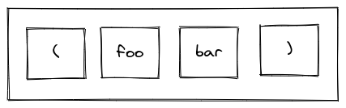

= 从零使用C语言构建一个Lisp解释器
:icons: font
:source-highlighter: highlightjs
:toc: left
:toclevels: 4
:sectnums:

== 第一章：简介

理解事物如何工作的最好方法是尝试自己构建它。阅读别人的解释可能会满足我们的好奇心，但是如果没有踩坑的经验，就很难理解为什么某些事物是以某种方式设计的。

有人说，每个程序员都应该编写一个编译器。尽管我认为这是个不错的建议（尽管我自己并没有遵循），但是在解析诸如C之类的语言时需要付出大量的努力，以至于任何潜在的见解都有可能迷失在细节中。也许为一些简单的语言创建一个解释器将是一个很好的第一步。

早在几年前，我开始使用LISP。我阅读了《计算机程序的结构和解释》。你需要阅读一下这本书。

这本书涵盖了许多主题，但是下半部分详细介绍了如何对LISP程序进行求值(eval)，也就是使用LISP本身实现了一个 `eval` 函数。我认为这可以很好地转换为C程序，因此决定尝试创建自己的LISP实现。

作为一名专业程序员，我将大部分时间都花在编写C和C++上。其余大多数是Java。有很多语言在那里，每个都有自己的优点值得商榷，但我想证明实现一个LISP机器是一件多简单的事情，甚至使用像C语言这样的底层语言来实现。

所以这是我的LISP的玩具实现。我已经从各种方言中借用了功能，但是它比Common LISP更接近Scheme。差异是微不足道的，以至于转换不需要对解释程序进行实质性的更改。如果你不熟悉LISP，请不要担心。我将在实现LISP的过程中定义所有内容。

它既不是最小的实现，也不是最高效的，也不是最完整的实现。但是它可以说是懒惰的。我的目标是编写功能强大，易于阅读的代码，该代码完全满足其需要，并且不再需要执行任何其他操作，并且我希望它可以传达构建诸如LISP之类的功能强大的环境所需的工作量。

== 第二章：数据

我们将首先定义四种对象：

* 整数：一个数字。例如：3,-9,0。
* 符号：由字符串组成的名称。例如：FOO,BAR,ADD-TWO。我们将在此项目中将符号规范化为大写，但这不是绝对必要的。
* `NIL` ：表示“无”。有点像C语言和其他语言中的 `NULL` 。
* `Pair` ：`Pair` 由两个元素组成，出于历史原因，它们被称为 `car` 和 `cdr` 。 `Pair` 中的两个元素可以是整数，符号， `NIL` ，或者其他 `Pair` 的引用。每个元素的类型可能不同。

整数，符号和 `NIL` 被称作简单数据类型。术语 *atom* 指任何一个简单数据类型或者 `Pair` 。

请注意，整数和符号是 _不可变的_ ，因此我们可以将具有相同值的两个整数视为同一对象。这对符号特别有用，因为它允许我们通过比较指针来测试两个符号是否相等。

=== 实现

让我们声明一些C类型来保存我们的数据。有许多聪明的方法可以有效地存储LISP对象，但是对于此实现，我们将坚持一个非常简单的方案。

[source,c]
----
struct Atom {
    enum {
        AtomType_Nil,
        AtomType_Pair,
        AtomType_Symbol,
        AtomType_Integer
    } type;

    union {
        struct Pair *pair;
        const char *symbol;
        long integer;
    } value;
};

struct Pair {
    struct Atom atom[2];
};

typedef struct Atom Atom;
----

定义一些宏将很方便：

[source,c]
----
#define car(p) ((p).value.pair->atom[0])
#define cdr(p) ((p).value.pair->atom[1])
#define nilp(atom) ((atom).type == AtomType_Nil)

static const Atom nil = { AtomType_Nil };
----

整数和指向字符串的指针可以拷贝，但是我们想要初始化 `Pair` 的话，需要从堆( `Heap` )上申请内存。

[source,c]
----
Atom cons(Atom car_val, Atom cdr_val)
{
    Atom p;
    
    p.type = AtomType_Pair;
    p.value.pair = malloc(sizeof(struct Pair));
    
    car(p) = car_val;
    cdr(p) = cdr_val;
    
    return p;
}
----

`cons` 是这样一个函数，它在堆上分配一个 `Pair` ，然后对 `Pair` 的两个元素进行赋值。

=== 测试

现在我们可以创建一些LISP对象了。创建一个整数：

[source,c]
----
Atom make_int(long x)
{
    Atom a;
    a.type = AtomType_Integer;
    a.value.integer = x;
    return a;
}
----

创建一个符号：

[source,c]
----
Atom make_sym(const char *s)
{
    Atom a;
    a.type = AtomType_Symbol;
    a.value.symbol = strdup(s);
    return a;
}
----

=== 文本表示

我们可以将一个 `Pair` 写作下面这种方式：

[source,lisp]
----
(a . b)
----

`a` 是 `car` ， `b` 是 `cdr` 。

将 `pair` 中的 `cdr` 部分指向另一个 `pair` ，我们就可以创建一个链了。比如下面这样：

[source,lisp]
----
(a . (b . (c . (d . NIL))))
----

请注意，最后一个 `pair` 的 `cdr` 部分是一个 `NIL` ，这标示了链的结束。我们叫这个链为 `列表` 。为了避免写大量的括号，我们可以将上面的列表写成下面这种格式：

[source,lisp]
----
(a b c d)
----

如果列表中的最后一个 `pair` 的 `cdr` 部分不是 `NIL` 的话，可以写作如下形式：

[source,lisp]
----
(p q . r)
----

等价于：

[source,lisp]
----
(p . (q . r))
----

以上这种写法被成为 _improper list_ 。

=== 实现

打印一个符号或者 `Pair` 很简单。代码如下：

[source,c]
----
void print_expr(Atom atom)
{
    switch (atom.type) {
    case AtomType_Nil:
        printf("NIL");
        break;
    case AtomType_Pair:
        putchar('(');
        print_expr(car(atom));
        atom = cdr(atom);
        while (!nilp(atom)) {
            if (atom.type == AtomType_Pair) {
                putchar(' ');
                print_expr(car(atom));
                atom = cdr(atom);
            } else {
                printf(" . ");
                print_expr(atom);
                break;
            }
        }
        putchar(')');
        break;
    case AtomType_Symbol:
        printf("%s", atom.value.symbol);
        break;
    case AtomType_Integer:
        printf("%ld", atom.value.integer);
        break;
    }
}
----

通过使用递归的方式，我们可以打印任意复杂的数据结构。当然如果打印一个嵌套很深的数据结构时，可能会出现栈空间不足。而打印一个存在循环引用的数据结构时，也会出现死循环。

=== 测试

[cols="1,1"]
|===
| *Atom* | *Output*
| make_int(42) | 42
| make_sym("FOO") | FOO
| cons(make_sym("X"), make_sym("Y")) | (X . Y)
| cons(make_int(1),
  cons(make_int(2),
  cons(make_int(3),
  nil))) | (1 2 3)
|===

可以看到，这些事情很简单。下一章我们将会搞一些更复杂的事情。

=== 最后一件事情

还记得我们说过我们将相同的符号视为相同的对象吗？我们可以强制跟踪每一个创建的符号，如果创建了一个之前已经创建过的字符序列，我们将返回同一个符号。

如果实现的语言是内置了集合或者哈希表数据结构的语言的话，实现这个功能将会很容易。但是我们也可以使用已经实现的LISP数据结构，将符号存储在一个列表中。

[source,c]
----
static Atom sym_table = { AtomType_Nil };

Atom make_sym(const char *s)
{
    Atom a, p;

    p = sym_table;
    while (!nilp(p)) {
        a = car(p);
        if (strcmp(a.value.symbol, s) == 0)
            return a;
        p = cdr(p);
    }

    a.type = AtomType_Symbol;
    a.value.symbol = strdup(s);
    sym_table = cons(a, sym_table);

    return a;
}
----

这个实现看起来不是很高效，是吗？但足够用了，代码可读性也很好。

== 第三章：解析器

下一个阶段就是解析了。就是读取一行文本，然后创建这个文本所表示的对象。如果这行文本并不表示我们定义过的对象，我们需要抛出错误。

=== 错误处理

错误的定义如下：

[source,c]
----
typedef enum {
    Error_OK = 0,
    Error_Syntax
} Error;
----

如果像我一样，你学过BASIC编程，那么你将很熟悉可怕的 `SYNTAX ERROR` 。现在是我们从栅栏另一侧看东西的机会。从现在开始，我们的大多数函数都将返回错误，以指示是否出了问题以及出了什么问题。

=== 词法分析（Lexer）

我没有接受过CS的正式培训，但是据我了解，它的想法是将字符串拆分成 `token` 的列表，这些 `token` 既是“单词”又是“标点符号”，并丢弃所有无关紧要的空格。因此，如果输入为：

[source,lisp]
----
(foo bar)
----

那么经过词法分析生成的4个 `token` 应该是：

让我们先来创建一个词法分析器（lexer），词法分析器将返回 `token` 的开始位置的指针和结束位置的指针。

[source,c]
----
int lex(const char *str, const char **start, const char **end)
{
    const char *ws = " \t\n";
    const char *delim = "() \t\n";
    const char *prefix = "()";

    // C 库函数 size_t strspn(const char *str1, const char *str2) 检索字符串 str1 中第一个不在字符串 str2 中出现的字符下标。
    // 检索字符串 str 中第一个不在字符串 ws 中出现的字符下标
    str += strspn(str, ws);

    if (str[0] == '\0') {
        *start = *end = NULL;
        return Error_Syntax;
    }

    *start = str;

    // C 库函数 char *strchr(const char *str, int c) 在参数 str 所指向的字符串中搜索第一次出现字符 c（一个无符号字符）的位置。
    if (strchr(prefix, str[0]) != NULL)
        *end = str + 1;
    else
        // C 库函数 size_t strcspn(const char *str1, const char *str2) 检索字符串 str1 开头连续有几个字符都不含字符串 str2 中的字符。
        *end = str + strcspn(str, delim);

    return Error_OK;
}
----

如果我们的词法分析器在没有找到 `token` 的情况下已经来到了字符串的末尾（即，字符串的其余部分完全是空格），则它将返回语法错误并将开始和结束设置为NULL。

=== 解析器

现在我们可以考虑解析器本身。入口点是 `read_expr` 函数，它将读取单个（可能是复杂的）对象，并返回错误状态和指向输入其余部分的指针。

[source,c]
----
int read_expr(const char *input, const char **end, Atom *result);
----

我们将首先处理简单的数据：整数，符号和NIL。如果有一个正则表达式库，那么这很容易，但是使用C语言也不复杂。

[source,c]
----
int parse_simple(const char *start, const char *end, Atom *result)
{
    char *buf, *p;

    /* Is it an integer? */
    long val = strtol(start, &p, 10);
    if (p == end) {
        result->type = AtomType_Integer;
        result->value.integer = val;
        return Error_OK;
    }

    /* NIL or symbol */
    buf = malloc(end - start + 1);
    p = buf;
    while (start != end)
        *p++ = toupper(*start), ++start;
    *p = '\0';

    if (strcmp(buf, "NIL") == 0)
        *result = nil;
    else
        *result = make_sym(buf);

    free(buf);

    return Error_OK;
}
----

注意两件事：首先，我们将输入转换为大写。这不是严格必要的-区分大小写的lisp没有错-但这是传统的行为。其次， `NIL` 是一个特例：它直接解析为 `AtomType_Nil` ，而不是将其解析为符号。

如果你熟悉LISP的各种方言，那么你将知道 `NIL` 不一定与 `()` 空列表相同。我们可以选择将 `NIL` 视为求值结果是自身的符号，但是对于本项目，我们将认为两种表示形式完全相同。

接下来是列表（包括 improper 列表和对）。简化的列表语法使此操作有些复杂，因此我们将其全部保留在辅助函数中。递归再次使我们能够处理嵌套列表。

[source,c]
----
int read_list(const char *start, const char **end, Atom *result)
{
    Atom p;

    *end = start;
    p = *result = nil;

    for (;;) {
        const char *token;
        Atom item;
        Error err;

        err = lex(*end, &token, end);
        if (err)
            return err;

        if (token[0] == ')')
            return Error_OK;

        if (token[0] == '.' && *end - token == 1) {
            /* Improper list */
            if (nilp(p))
                return Error_Syntax;

            err = read_expr(*end, end, &item);
            if (err)
                return err;

            cdr(p) = item;

            /* Read the closing ')' */
            err = lex(*end, &token, end);
            if (!err && token[0] != ')')
                err = Error_Syntax;

            return err;
        }

        err = read_expr(token, end, &item);
        if (err)
            return err;

        if (nilp(p)) {
            /* First item */
            *result = cons(item, nil);
            p = *result;
        } else {
            cdr(p) = cons(item, nil);
            p = cdr(p);
        }
    }
}
----

我不喜欢写无限循环，但这是我到目前为止写出的结构最清晰的代码。

最后，我们有了 `read_expr` 本身，由于我们已经完成了所有艰苦的工作，所以这很简单：

[source,c]
----
int read_expr(const char *input, const char **end, Atom *result)
{
    const char *token;
    Error err;

    err = lex(input, &token, end);
    if (err)
        return err;

    if (token[0] == '(')
        return read_list(*end, end, result);
    else if (token[0] == ')')
        return Error_Syntax;
    else
        return parse_simple(token, *end, result);
}
----

这里对右括号的检查将会捕获一些不合法的代码形式，例如：

[source,scheme]
----
)
----

以及

[source,scheme]
----
(X .)
----

=== 测试

如果使用解析器创建一个简单的读取-打印循环（read-print-loop），则可以在控制台上键入对象的表示形式并检查是否正确解析了它们。

[source,c]
----
int main(int argc, char **argv)
{
    char *input;

    while ((input = readline("> ")) != NULL) {
        const char *p = input;
        Error err;
        Atom expr;

        err = read_expr(p, &p, &expr);

        switch (err) {
        case Error_OK:
            print_expr(expr);
            putchar('\n');
            break;
        case Error_Syntax:
            puts("Syntax error");
            break;
        }

        free(input);
    }

    return 0;
}
----

上面的代码使用了 `readline` 库，该库显示提示并从控制台读取一行文本。它支持的编辑功能很强大，但是围绕 `fgets()` 的简单封装也可以做到相同的事情。

[source,text]
----
> 42
42
> (foo bar)
(FOO BAR)
> (s (t . u) v . (w . nil))
(S (T . U) V W)
> ()
NIL
----

=== 完整代码

[source,c]
----
#include <stdio.h>
#include <string.h>
#include <stdlib.h>
#include <ctype.h>
#include <readline/readline.h>

typedef enum {
    Error_OK = 0,
    Error_Syntax
} Error;

struct Atom
{
    enum {
        AtomType_Nil,
        AtomType_Pair,
        AtomType_Symbol,
        AtomType_Integer
    } type;

    union {
        struct Pair *pair;
        const char *symbol;
        long integer;
    } value;
};

struct Pair {
    struct Atom atom[2];
};

typedef struct Atom Atom;

#define car(p) ((p).value.pair->atom[0])
#define cdr(p) ((p).value.pair->atom[1])
#define nilp(atom) ((atom).type == AtomType_Nil)

static const Atom nil = { AtomType_Nil };

Atom cons(Atom car_val, Atom cdr_val)
{
    Atom p;

    p.type = AtomType_Pair;
    p.value.pair = malloc(sizeof(struct Pair));

    car(p) = car_val;
    cdr(p) = cdr_val;

    return p;
}

Atom make_int(long x)
{
    Atom a;
    a.type = AtomType_Integer;
    a.value.integer = x;
    return a;
}

Atom make_sym(const char *s)
{
    Atom a;
    a.type = AtomType_Symbol;
    a.value.symbol = strdup(s);
    return a;
}

int lex(const char *str, const char **start, const char **end)
{
    const char *ws = " \t\n";
    const char *delim = "() \t\n";
    const char *prefix = "()";

    str += strspn(str, ws);

    if (str[0] == '\0') {
        *start = *end = NULL;
        return Error_Syntax;
    }

    *start = str;

    // strchr函数功能为在一个串中查找给定字符的第一个匹配之处
    if (strchr(prefix, str[0]) != NULL)
        *end = str + 1;
    else
    // 该函数返回 str1 开头连续都不含字符串 str2 中字符的字符数。
        *end = str + strcspn(str, delim);

    return Error_OK;
}

int read_expr(const char *input, const char **end, Atom *result);

int parse_simple(const char *start, const char *end, Atom *result)
{
    char *buf, *p;

    long val = strtol(start, &p, 10);
    if (p == end) {
        result->type = AtomType_Integer;
        result->value.integer = val;
        return Error_OK;
    }

    buf = malloc(end - start + 1);
    p = buf;
    while (start != end)
        *p++ = toupper(*start), ++start;
    *p = '\0';

    if (strcmp(buf, "NIL") == 0) {
        *result = nil;
    } else {
        *result = make_sym(buf);
    }

    free(buf);
    
    return Error_OK;
}

int read_list(const char *start, const char **end, Atom *result)
{
    Atom p;

    *end = start;
    p = *result = nil;

    for (;;) {
        const char *token;
        Atom item;
        Error err;

        err = lex(*end, &token, end);
        if (err) {
            return err;
        }

        if (token[0] == ')') {
            return Error_OK;
        }

        if (token[0] == '.' && *end - token == 1) {
            if (nilp(p)) {
                return Error_Syntax;
            }

            err = read_expr(*end, end, &item);
            if (err) {
                return err;
            }

            cdr(p) = item;

            err = lex(*end, &token, end);
            if (!err && token[0] != ')') {
                err = Error_Syntax;
            }

            return err;
        }

        err = read_expr(token, end, &item);
        if (err) {
            return err;
        }

        if (nilp(p)) {
            *result = cons(item, nil);
            p = *result;
        } else {
            cdr(p) = cons(item, nil);
            p = cdr(p);
        }
    }
}

int read_expr(const char *input, const char **end, Atom *result)
{
    const char *token;
    Error err;

    err = lex(input, &token, end);
    if (err) return err;

    if (token[0] == '(') {
        return read_list(*end, end, result);
    } else if (token[0] == ')') {
        return Error_Syntax;
    } else {
        return parse_simple(token, *end, result);
    }
}

void print_expr(Atom atom)
{
    switch (atom.type)
    {
    case AtomType_Nil:
        printf("NIL");
        break;

    case AtomType_Pair:
        putchar('(');
        print_expr(car(atom));
        atom = cdr(atom);
        while (!nilp(atom)) {
            if (atom.type == AtomType_Pair) {
                putchar(' ');
                print_expr(car(atom));
                atom = cdr(atom);
            } else {
                printf(" . ");
                print_expr(atom);
                break;
            }
        }
        putchar(')');
        break;

    case AtomType_Symbol:
        printf("%s", atom.value.symbol);
        break;

    case AtomType_Integer:
        printf("%ld", atom.value.integer);
        break;
    
    default:
        break;
    }
}

int main(int argc, char const *argv[])
{
    char *input;

    while ((input = readline("> ")) != NULL) {
        const char *p = input;
        Error err;
        Atom expr;

        err = read_expr(p, &p, &expr);

        switch (err)
        {
        case Error_OK:
            print_expr(expr);
            putchar('\n');
            break;
        case Error_Syntax:
            puts("Syntax error");
            break;
        }

        free(input);
    }

    return 0;
}
----

在Ubuntu环境下，可以安装 readline 库，然后再编译的时候需要链接上这个库。

[source,bash]
----
$ sudo apt-get install libreadline6-dev
$ gcc lisp.c -lreadline -o lisp
----

== 第四章：表达式、环境和求值

=== 表达式

在LISP中，一切都是表达式。表达式可以是字面量，标识符或由运算符和一个或多个参数组成的列表。

字面量是具有内在值的对象。在我们的系统中，它可以是整数或NIL（如果你认为"nothing"是一个值的话）。

标识符是对象的名称。符号可以是标识符。

其他所有内容都是形式为 `(运算符 参数...)` 的列表，其中 `参数...` 表示零个或多个参数。

=== 环境

为了将标识符和对象关联起来，我们需要 _环境_ 。环境是一系列绑定（binding）的集合。每一个绑定由一个标识符和标识符所对应的值组成。例如：

.绑定（bindings） 
|===
| *标识符* | *值*
| FOO | 42
| BAR | NIL
| BAZ | (X Y Z)
|===

注意：所有的标识符都是符号。但是值可以是任意对象。例如BAZ就是一个包含三个符号的列表。

一个环境可能会有一个 _父环境_ 。如果在一个环境里面，不存在某个标识符对应的绑定，那么就会去父环境里去找这个标识符的绑定，如果还找不到，那么就会去父环境的父环境寻找标识符的绑定。所以可以看到，我们这里其实是创建了一棵环境树，一个环境会共享它的父环境的绑定。

==== 实现

下面的代码是表达环境的一种传统方式，使用了LISP中的数据类型。

[source,scheme]
----
(parent (identifier . value)...)
----

所以上面的表：绑定所对应的环境如下（没有parent）：

[source,scheme]
----
(NIL (FOO . 42) (BAR . NIL) (BAZ . (X Y Z)))
----

以下的C代码创建了一个空环境，这个空环境的父环境是parent（parent也可以是NIL）

[source,c]
----
Atom env_create(Atom parent)
{
    return cons(parent, nil);
}
----

接下来我们写两个函数用来获取和创建环境中的绑定。

[source,c]
----
int env_get(Atom env, Atom symbol, Atom *result)
{
    Atom parent = car(env);
    Atom bs = cdr(env);

    while (!nilp(bs)) {
        Atom b = car(bs);
        if (car(b).value.symbol == symbol.value.symbol) {
            *result = cdr(b);
            return Error_OK;
        }
        bs = cdr(bs);
    }

    if (nilp(parent))
        return Error_Unbound;

    return env_get(parent, symbol, result);
}
----

由于我们禁止命名两个相同名字的符号，所以我们这里不需要调用 `strcmp` 函数，这意味着 `lookup` 函数运行起来速度不会太慢。

[source,c]
----
int env_set(Atom env, Atom symbol, Atom value)
{
    Atom bs = cdr(env);
    Atom b = nil;

    while (!nilp(bs)) {
        b = car(bs);
        if (car(b).value.symbol == symbol.value.symbol) {
            cdr(b) = value;
            return Error_OK;
        }
        bs = cdr(bs);
    }

    b = cons(symbol, value);
    cdr(env) = cons(b, cdr(env));

    return Error_OK;
}
----

只有 `env_get` 函数会递归的去检查父环境。因为我们并不想修改父环境的绑定。

=== 求值

我们需要对表达式进行求值。求值过程的输入是一个表达式和一个环境，输出是一个值。让我们规定一下求值的规则。

* 字面量的求值结果是它本身。
* 环境可以让我们找到一个标识符所对应的值是什么。如果环境中不存在一个标识符所对应的值，那么对这个标识符求值会返回错误。
* 一个列表表达式如果具有以下某个操作符，就成为一个 _特殊形式_ (special form)：
    * *QUOTE* ：表达式 `(QUOTE EXPR)` 的求值结果是： `EXPR` 。这个 `EXPR` 被直接返回，并没有进行求值。
    * *DEFINE* ：对表达式 `(DEFINE SYMBOL EXPR)` 进行求值将会创建一个针对 `SYMBOL` 在环境中的绑定，或者修改这个 `SYMBOL` 在环境中的绑定。 `SYMBOL` 将会绑定到 `EXPR` 的求值结果。 `DEFINE` 表达式的求值结果将返回 `SYMBOL` 。
* 对其他任何形式的表达式进行求值都是无效的。

==== 实现

我们需要检查一下一个表达式是否是正规列表（proper list）。

[source,c]
----
int listp(Atom expr)
{
    while (!nilp(expr)) {
        if (expr.type != AtomType_Pair)
            return 0;
        expr = cdr(expr);
    }
    return 1;
}
----

Error枚举类型需要一些更多的选项：

|===
| Error_Unbound | 试图去对一个不存在绑定的符号求值
| Error_Args    | 一个列表表达式比预期的长或者短
| Error_Type    | 表达式中对象的类型和预期的不一样（类型错误）
|===

我们直接将表达式的求值规则翻译成C语言就可以了。

[source,c]
----
int eval_expr(Atom expr, Atom env, Atom *result)
{
    Atom op, args;
    Error err;

    if (expr.type == AtomType_Symbol) {
        return env_get(env, expr, result);
    } else if (expr.type != AtomType_Pair) {
        *result = expr;
        return Error_OK;
    }

    if (!listp(expr))
        return Error_Syntax;

    op = car(expr);
    args = cdr(expr);

    if (op.type == AtomType_Symbol) {
        if (strcmp(op.value.symbol, "QUOTE") == 0) {
            if (nilp(args) || !nilp(cdr(args)))
                return Error_Args;

            *result = car(args);
            return Error_OK;
        } else if (strcmp(op.value.symbol, "DEFINE") == 0) {
            Atom sym, val;

            if (nilp(args) || nilp(cdr(args)) || !nilp(cdr(cdr(args))))
                return Error_Args;

            sym = car(args);
            if (sym.type != AtomType_Symbol)
                return Error_Type;

            err = eval_expr(car(cdr(args)), env, &val);
            if (err)
                return err;

            *result = sym;
            return env_set(env, sym, val);
        }
    }

    return Error_Syntax;
}
----

==== 测试

将读取-打印循环扩展成为 `读取-求值-打印` 循环（REPL）。REPL是LISP解释器的核心功能。

[source,c]
----
int main(int argc, char **argv)
{
    Atom env;
    char *input;

    env = env_create(nil);

    while ((input = readline("> ")) != NULL) {
        const char *p = input;
        Error err;
        Atom expr, result;

        err = read_expr(p, &p, &expr);		

        if (!err)
            err = eval_expr(expr, env, &result);

        switch (err) {
        case Error_OK:
            print_expr(result);
            putchar('\n');
            break;
        case Error_Syntax:
            puts("Syntax error");
            break;
        case Error_Unbound:
            puts("Symbol not bound");
            break;
        case Error_Args:
            puts("Wrong number of arguments");
            break;
        case Error_Type:
            puts("Wrong type");
            break;
        }

        free(input);
    }

    return 0;
}
----

让我们看一下结果：

[source,text]
----
> foo
Symbol not bound
> (quote foo)
FOO
> (define foo 42)
FOO
> foo
42
> (define foo (quote bar))
FOO
> foo
BAR
----

== 第五章：内建函数

到目前为止，在我们的实现中，我们已经使用了 `car` ， `cdr` 和 `cons` 函数来构造和访问LISP数据。现在，我们将在解释环境中提供相同的功能。

我们将扩展列表表达式语法以添加一些新的运算符：

* `(CAR EXPR)` ：对 `EXPR` 进行求值，然后返回求值结果的 `car` 部分。如果 `EXPR` 的求值结果既不是 `pair` 也不是 `NIL` ，则返回错误。
* `(CDR EXPR)` ：对 `EXPR` 进行求值，然后返回求值结果的 `cdr` 部分。如果 `EXPR` 的求值结果既不是 `pair` 也不是 `NIL` ，则返回错误。
* `(CONS A B)` ：Evaluates both arguments A and B, and returns a newly constructed pair containing the results.对 `A` 和 `B` 进行求值，然后返回包含 `A` 和 `B` 的求值结果的 `pair` 。

在上面的定义中，我们允许对 `NIL` 取 `car` 部分和 `cdr` 部分，不像我们之前C版本对 `car` 和 `cdr` 的实现。如果对 `NIl` 取 `car` 和 `cdr` 的值定义为 `NIL` ，那么一些算法会相对容易实现一些。

我们选择在 `eval_expr` 函数中添加一些分支条件来实现上面定义的内置函数，就像我们之前实现 `QUOTE` 和 `DEFINE` 一样。尽管如此，我们想在未来添加更多的运算符，而将每个运算符都添加到 `eval_expr` 中会让函数变得很长。所以我们现在来介绍一下函数的概念。

*函数*

一个函数就是一个代码片段，这个代码片段将一些参数转换成了一个值。如果 `eval_expr` 碰到了一个列表表达式，而列表表达式中有一个函数是运算符，那么 `eval_expr` 所要做的就是执行函数的代码片段，然后将所得到的求值结果作为表达式的结果返回。

实现函数的方式就是创建一些C函数，可以被 `eval_expr` 所调用。我们称这些函数为内置函数或者原始函数。让我们来看一下如何扩展我们的LISP解释器将函数包含进来。

=== 一种新的Atom类型

`eval_expr` 将通过C的函数指针来调用内置函数，所以内置函数的类型必须一样：

[source,c]
----
typedef int (*Builtin)(struct Atom args, struct Atom *result);
----

上面是一个函数指针类型，这个函数指针的类型是 `Builtin` ，接收两个参数，返回值是 `int` 。

为了可以在表达式中出现函数，我们需要一种新的 `atom` 类型来表示它们。

[source,c]
----
struct Atom {
    enum {
        .
        .
        .
        AtomType_Builtin
    } type;

    union {
        .
        .
        .
        Builtin builtin;
    } value;
};
----

我们之前写过的代码用". . ."表示省略。为了代码的完整性， `print_expr` 需要知道如何显示新的 `atom` 类型：

[source,c]
----
void print_expr(Atom atom)
{
    switch (atom.type) {
    .
    .
    .
    case AtomType_Builtin:
        printf("#<BUILTIN:%p>", atom.value.builtin);
        break;
    }
}
----

最终，我们写一个辅助方法来创建新的 `atom` 类型：

[source,c]
----
Atom make_builtin(Builtin fn)
{
    Atom a;
    a.type = AtomType_Builtin;
    a.value.builtin = fn;
    return a;
}
----

=== 扩展求值器

我们将对参数列表进行 _浅拷贝_ 。

[source,c]
----
Atom copy_list(Atom list)
{
    Atom a, p;

    if (nilp(list))
        return nil;

    a = cons(car(list), nil);
    p = a;
    list = cdr(list);

    while (!nilp(list)) {
        cdr(p) = cons(car(list), nil);
        p = cdr(p);
        list = cdr(list);
    }

    return a;
}
----

*apply* 仅仅只是针对一个参数列表调用内置函数。我们将在后面扩展这个函数，因为我们需要处理一些其他的求值函数。

[source,c]
----
int apply(Atom fn, Atom args, Atom *result)
{
    if (fn.type == AtomType_Builtin)
        return (*fn.value.builtin)(args, result);

    return Error_Type;
}
----

如果列表表达式不是我们之前定义过的 _特殊形式_ ，那么我们将假设运算符将会被求值成一个函数。我们将对参数列表中的每一个参数进行求值，然后使用 `apply` 来将函数作用到参数列表求值以后的结果列表上。

[source,c]
----
int eval_expr(Atom expr, Atom env, Atom *result)
{
    Atom op, args, p;
    Error err;

    .
    .
    .

    if (op.type == AtomType_Symbol) {
        .
        .
        .
    }

    /* Evaluate operator */
    err = eval_expr(op, env, &op);
    if (err)
        return err;

    /* Evaulate arguments */
    args = copy_list(args);
    p = args;
    while (!nilp(p)) {
        err = eval_expr(car(p), env, &car(p));
        if (err)
            return err;

        p = cdr(p);
    }

    return apply(op, args, result);
}
----

我们在对参数列表进行求值时，先对参数列表进行浅拷贝。这样就避免了把旧的参数列表覆盖掉。因为我们可能会再一次使用旧的参数列表。

=== 初始环境

之前我们为LISP的 `读取——求值——打印` 循环创建过一个空环境。用户没有办法创建表示内置函数的 `atom` 类型。所以我们会在初始环境中绑定好内置函数。

以下是函数：

[source,c]
----
int builtin_car(Atom args, Atom *result)
{
    if (nilp(args) || !nilp(cdr(args)))
        return Error_Args;

    if (nilp(car(args)))
        *result = nil;
    else if (car(args).type != AtomType_Pair)
        return Error_Type;
    else
        *result = car(car(args));

    return Error_OK;
}
----

函数中的大部分代码都是错误处理和类型检查。这样来创建函数真是一件烦人的事情。

[source,c]
----
int builtin_cdr(Atom args, Atom *result)
{
    if (nilp(args) || !nilp(cdr(args)))
        return Error_Args;

    if (nilp(car(args)))
        *result = nil;
    else if (car(args).type != AtomType_Pair)
        return Error_Type;
    else
        *result = cdr(car(args));

    return Error_OK;
}
----

`builtin_cdr` 和 `builtin_car` 几乎是一样的。

[source,c]
----
int builtin_cons(Atom args, Atom *result)
{
    if (nilp(args) || nilp(cdr(args)) || !nilp(cdr(cdr(args))))
        return Error_Args;

    *result = cons(car(args), car(cdr(args)));

    return Error_OK;
}
----

有了以上的函数，我们就可以使用 `env_set` 函数来创建绑定了。

[source,c]
----
int main(int argc, char **argv)
{
    Atom env;
    char *input;

    env = env_create(nil);

    /* Set up the initial environment */
    env_set(env, make_sym("CAR"), make_builtin(builtin_car));
    env_set(env, make_sym("CDR"), make_builtin(builtin_cdr));
    env_set(env, make_sym("CONS"), make_builtin(builtin_cons));

    while ((input = readline("> ")) != NULL) {
        .
        .
        .
    }

    return 0;
}
----

=== 测试

[source,text]
----
> (define foo 1)
FOO
> (define bar 2)
BAR
> (cons foo bar)
(1 . 2)
> (define baz (quote (a b c)))
BAZ
> (car baz)
A
> (cdr baz)
(B C)
----

NOTE: `(CONS FOO BAR)` 和 `(QUOTE (FOO . BAR))` 是不一样的。前者将会对参数列表进行求值，然后创建一个新的 `pair` 。

== 第六章：算术表达式

到目前为止，我们所能做的就是创建和命名对象。这些对象中有些是数字——自然，我们想对这些数字进行计算。

在上一章中，我们看到了如何创建内置函数来告诉eval_expr如何将参数处理为返回值。现在，我们将再创建四个内建函数来执行基本的算术运算。

|===
| Expression | Result
| (+ X Y) | The sum of X and Y
| (- X Y) | The difference of X and Y
| (* X Y) | The product of X and Y
| (/ X Y) | The quotient of X and Y
|===

在上面的定义中，当我们写“X和Y的总和”时，我们真正的意思是“通过求值X和Y所获得的值的总和”。请记住，默认情况下，eval_expr将对函数的所有参数求值；这通常是我们想要发生的事情，因此从现在开始，我们将不会在意图明显的地方明确声明这一点。

=== 实现

再一次，几乎我们所有的函数都包括检查是否提供了正确的参数。最后，通过调用 `make_int` 构造结果。

[source,c]
----
int builtin_add(Atom args, Atom *result)
{
    Atom a, b;

    if (nilp(args) || nilp(cdr(args)) || !nilp(cdr(cdr(args))))
        return Error_Args;

    a = car(args);
    b = car(cdr(args));

    if (a.type != AtomType_Integer || b.type != AtomType_Integer)
        return Error_Type;

    *result = make_int(a.value.integer + b.value.integer);

    return Error_OK;
}
----

其他三个函数仅相差一个字符，因此在此将其省略。

最后，我们需要在初始环境中为我们的新功能创建绑定：

[source,c]
----
env_set(env, make_sym("+"), make_builtin(builtin_add));
env_set(env, make_sym("-"), make_builtin(builtin_subtract));
env_set(env, make_sym("*"), make_builtin(builtin_multiply));
env_set(env, make_sym("/"), make_builtin(builtin_divide));
----

=== 测试

现在，我们有了自己的LISP风格的计算器。

[source,text]
----
> (+ 1 1)
2
> (define x (* 6 9))
X
> x
54
> (- x 12)
42
----

在上面的最后一个表达式中，请注意X是一个符号，而不是整数。我们必须对参数进行求值，以便builtin_subtract可以对绑定到X的整数值进行运算，而不是对符号X本身进行运算。同样，绑定到X的值是计算表达式（* 6 9）的整数结果。

== 第七章：Lambda表达式和闭包

这是事情开始变得有趣的地方。现在，我们将实现对lambda表达式的支持，这是一种在我们已经可以处理的LISP表达式之外动态构建函数的方法。

Lambda表达式是具有特定语法的列表表达式：

[source,scheme]
----
(LAMBDA (arg...) expr...)
----

求值lambda表达式的结果是一种新型的对象，我们称其为闭包。闭包可以以与内置函数相同的方式在列表表达式中使用。在这种情况下，参数将绑定到lambda表达式中以 `arg...` 列出的符号。函数的主体由表达式 `expr...` 组成，这些表达式将依次求值。求值最终表达式的结果是将参数应用于闭包的结果。

这是一个非常密集的定义，因此这是一个我们如何使用lambda表达式的示例：

[source,scheme]
----
(DEFINE SQUARE (LAMBDA (X) (* X X)))
----

`SQUARE` 现在是一个函数，有一个参数X，返回值是X的平方。所以对 `(SQUARE 3)` 进行求值应该返回9。

=== 实现

我们将使用列表来表示闭包：

[source,scheme]
----
(env (arg...) expr...)
----

env是定义闭包的环境。这是必需的，以允许lambda函数使用绑定而不必将其作为参数传递。例如，回想一下，CAR在初始环境中绑定到了我们原始的builtin_car函数。

第一个任务是为Atom结构的type字段添加一个新的常量：

[source,c]
----
struct Atom {
    enum {
        .
        .
        .
        AtomType_Closure
    } type;

    union {
        .
        .
        .
    } value;
};
----

由于闭包只是常规列表，因此无需添加任何值。

像其他原子类型一样，我们将创建一个实用程序函数来初始化它们。 `make_closure` 与其他命令不同，对参数执行一些验证，因此需要返回错误代码。

[source,c]
----
int make_closure(Atom env, Atom args, Atom body, Atom *result)
{
    Atom p;

    if (!listp(args) || !listp(body))
        return Error_Syntax;

    /* Check argument names are all symbols */
    p = args;
    while (!nilp(p)) {
        if (car(p).type != AtomType_Symbol)
            return Error_Type;
        p = cdr(p);
    }

    *result = cons(env, cons(args, body));
    result->type = AtomType_Closure;

    return Error_OK;
}
----

接下来是eval中的另一种特殊情况，每当遇到lambda表达式时都创建一个闭包。

[source,c]
----
int eval_expr(Atom expr, Atom env, Atom *result)
{
    .
    .
    .
    if (op.type == AtomType_Symbol) {
        if (strcmp(op.value.symbol, "QUOTE") == 0) {
        .
        .
        .
        } else if (strcmp(op.value.symbol, "LAMBDA") == 0) {
            if (nilp(args) || nilp(cdr(args)))
                return Error_Args;

            return make_closure(env, car(args), cdr(args), result);
        }
    }
    .
    .
    .
}
----

上面的SQUARE示例的函数体用X表示。为了对函数体进行求值，我们需要创建一个新环境，其中X绑定到参数的值：

[source,scheme]
----
(closure-env (X . 3))
----

父环境 `closure-env` 是存储在闭包中的环境。

最后，我们扩展 `apply` 函数以创建新环境，并为函数体中的每个表达式调用eval。

[source,c]
----
int apply(Atom fn, Atom args, Atom *result)
{
    Atom env, arg_names, body;

    if (fn.type == AtomType_Builtin)
        return (*fn.value.builtin)(args, result);
    else if (fn.type != AtomType_Closure)
        return Error_Type;

    env = env_create(car(fn));
    arg_names = car(cdr(fn));
    body = cdr(cdr(fn));

    /* Bind the arguments */
    while (!nilp(arg_names)) {
        if (nilp(args))
            return Error_Args;
        env_set(env, car(arg_names), car(args));
        arg_names = cdr(arg_names);
        args = cdr(args);
    }
    if (!nilp(args))
        return Error_Args;

    /* Evaluate the body */
    while (!nilp(body)) {
        Error err = eval_expr(car(body), env, result);
        if (err)
            return err;
        body = cdr(body);
    }

    return Error_OK;
}
----

=== 测试

让我们检查一下我们的SQUARE函数是否按预期工作。

[source,scheme]
----
> (define square (lambda (x) (* x x)))
SQUARE
> (square 3)
9
> (square 4)
16
----

当然，lambda表达式不必绑定到符号——我们可以创建匿名函数。

[source,scheme]
----
> ((lambda (x) (- x 2)) 7)
5
----

函数式编程的爱好者将很高兴看到我们现在可以做这种事情：

[source,scheme]
----
> (define make-adder (lambda (x) (lambda (y) (+ x y))))
MAKE-ADDER
> (define add-two (make-adder 2))
ADD-TWO
> (add-two 5)
7
----

你知道值“2”存储在哪里吗？

== 第八章：布尔值和短路求值

== 第九章：语法糖

== 第十章：变长参数函数

== 第十一章：宏

== 第十二章：库

== 第十三章：准引用

== 第十四章：延续和尾递归

== 第十五章：垃圾收集

== 第十六章：接下来做什么？
